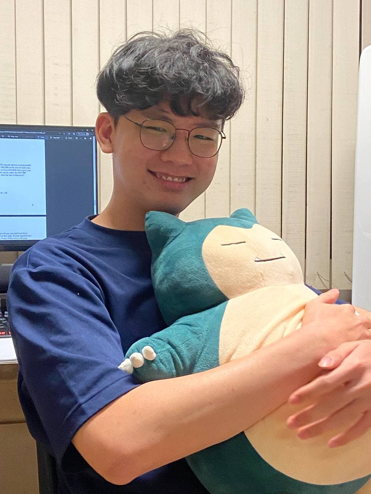

Around the World in $80 was developed by the AY2122S1-CS2103T-F13-1 team.

We are a team based in the [School of Computing, National University of Singapore](http://www.comp.nus.edu.sg).

This project is based on the AddressBook-Level3 project created by the [SE-EDU initiative](https://se-education.org).

## Project team

### Chrus Chong Kai Ngee

[LinkedIn](https://www.linkedin.com/in/chrus-chong/)
[GitHub](https://github.com/chrus-chong)
[Portfolio](team/chruschong.md)

* Role: Project Advisor

### Peh Hoe Khim Marcus

[LinkedIn](https://www.linkedin.com/in/marcuspeh/)
[Github](http://github.com/marcuspeh)
[Portfolio](team/marcuspeh.md)

* Role: Team Lead
* Responsibilities: UI

### Ramapriyan Srivatsan Purisai Devarajan

[LinkedIn](https://www.linkedin.com/in/ramapriyansrivatsanpd/)
[Github](https://github.com/ramapriyan912001)
[Portfolio](team/ramapriyansrivatsanpurisaidevarajan.md)

* Role: Team Lead
* Responsibilities: Backend Engineering

### Ee Kar Hee, Nicholas

[LinkedIn](https://www.linkedin.com/in/ekhn/)
[Github](http://github.com/kheekheekhee)
[Portfolio](team/johndoe.md)

* Role: Developer
* Responsibilities: Frontend Engineering

### Ong Jingwen

[Github](http://github.com/Jingwencloud)
[Portfolio](team/johndoe.md)

* Role: Developer

