<p align="center">
    
</p>
Around the World in $80 (AWE) is a desktop application for keeping track of spending and expenditure during travels, splitting 
expenses with travel-mates, and facilitating easy recollection of debts at the end of every trip. AWE is the world's
only bespoke app designed for group travellers.

The app promises to revolutionise the group-travel space. With AWE, bills can be split and monitored in a centralised
manner that minimises the potential for disputes and maximises the efficiency of payment and recollection of debts.

AWE's vision is a more interconnected world where relationships are more easily built and maintained.
Our mission is to accomplish through a user-centric approach that seeks to provide the user with what they need, at the
tip of their fingertips. This document marks the first step towards the accomplishment of that mission, and the
beginning of your journey around the world.

<div style="page-break-after: always;"></div>

<h2 style="font-size: 1.75rem; margin-top: 60px; color: #e46c0a; font-weight:400; margin-bottom: 15px;" id="tableofcontents"><strong>Table of Contents</strong></h2>
* Table of Contents
{:toc}
--------------------------------------------------------------------------------------------------------------------

## **Acknowledgements**

This project is based on the AddressBook-Level3 project created by the [SE-EDU initiative](https://se-education.org).

--------------------------------------------------------------------------------------------------------------------

## **Setting up, getting started**

Refer to the guide [_Setting up and getting started_](SettingUp.md).

--------------------------------------------------------------------------------------------------------------------

## **Design**

<div markdown="span" class="alert alert-primary">

:bulb: **Tip:** The `.puml` files used to create diagrams in this document can be found in the [diagrams](https://github.com/AY2122S1-CS2103T-F13-1/tp/tree/master/docs/diagrams/) folder. Refer to the [_PlantUML Tutorial_ at se-edu/guides](https://se-education.org/guides/tutorials/plantUml.html) to learn how to create and edit diagrams.
</div>

### Architecture


The ***Architecture Diagram*** given above explains the high-level design of the App.

Given below is a quick overview of main components and how they interact with each other.

**Main components of the architecture**

**`Main`** has two classes called [`Main`](https://github.com/AY2122S1-CS2103T-F13-1/tp/tree/master/src/main/java/seedu/awe/Main.java) and [`MainApp`](https://github.com/AY2122S1-CS2103T-F13-1/tp/tree/master/src/main/java/seedu/awe/MainApp.java). It is responsible for,
* At app launch: Initializes the components in the correct sequence, and connects them up with each other.
* At shut down: Shuts down the components and invokes cleanup methods where necessary.

[**`Commons`**](#common-classes) represents a collection of classes used by multiple other components.

The rest of the App consists of four components.

* [**`UI`**](#ui-component): The UI of the App.
* [**`Logic`**](#logic-component): The command executor.
* [**`Model`**](#model-component): Holds the data of the App in memory.
* [**`Storage`**](#storage-component): Reads data from, and writes data to, the hard disk.


**How the architecture components interact with each other**

The *Sequence Diagram* below shows how the components interact with each other for the scenario where the user issues the command `delete 1`.

<p align="center">
    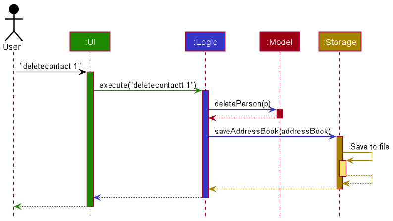
    <br>
    Fig 1. Architecture Sequence Diagram
</p>

Each of the four main components (also shown in the diagram above),

* defines its *API* in an `interface` with the same name as the Component.
* implements its functionality using a concrete `{Component Name}Manager` class (which follows the corresponding API `interface` mentioned in the previous point.

For example, the `Logic` component defines its API in the `Logic.java` interface and implements its functionality using the `LogicManager.java` class which follows the `Logic` interface. Other components interact with a given component through its interface rather than the concrete class (reason: to prevent outside component's being coupled to the implementation of a component), as illustrated in the (partial) class diagram below.


The sections below give more details of each component.

### UI component

The **API** of this component is specified in [`Ui.java`](https://github.com/AY2122S1-CS2103T-F13-1/tp/tree/master/src/main/java/seedu/awe/ui/Ui.java)

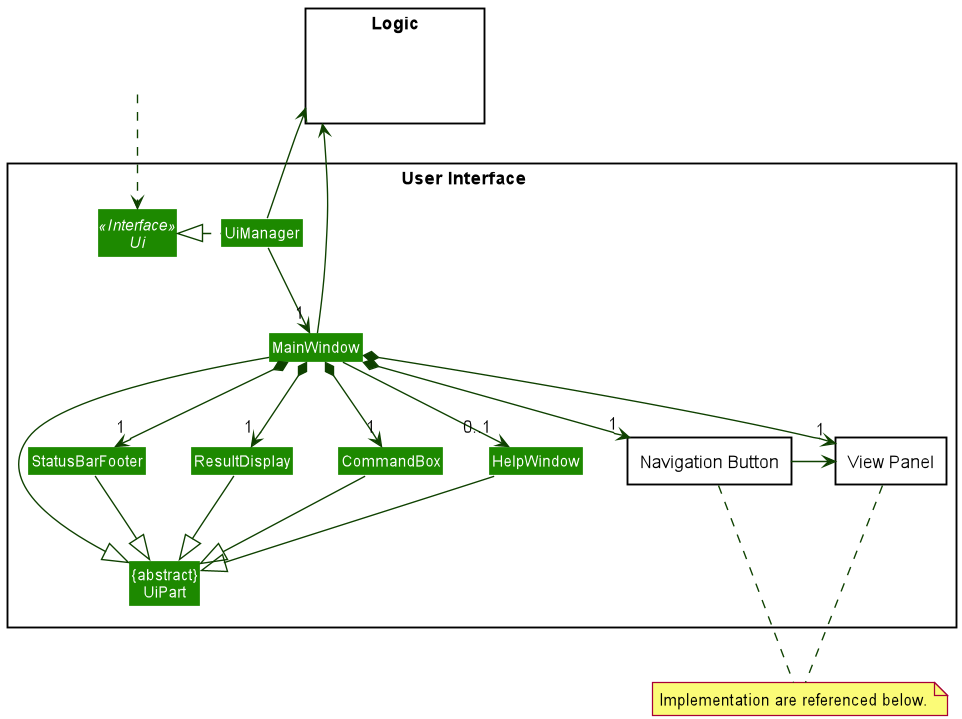

The UI consists of a `MainWindow` that is made up of parts e.g. `CommandBox`, `ResultDisplay`, `ViewPanel`, `NavigationButton` etc. 
All these, except for `GroupButtonListener` and `PersonButtonListner` in `NavigationButton`, inherit from the abstract `UiPart` class which captures the commonalities between classes that represent parts of the visible GUI.

The `UI` component uses the JavaFx UI framework. The layout of these UI parts are defined in matching `.fxml` files that are in the `src/main/resources/view` folder. For example, the layout of the [`MainWindow`](https://github.com/AY2122S1-CS2103T-F13-1/tp/tree/master/src/main/java/seedu/awe/ui/MainWindow.java) is specified in [`MainWindow.fxml`](https://github.com/AY2122S1-CS2103T-F13-1/tp/tree/master/src/main/resources/view/MainWindow.fxml)

The `UI` component,

* executes user commands using the `Logic` component.
* listens for changes to `Model` data so that the UI can be updated with the modified data.
* keeps a reference to the `Logic` component, because the `UI` relies on the `Logic` to execute commands.
* depends on some classes in the `Model` component, as it displays `Person` object residing in the `Model`.

#### View Panel
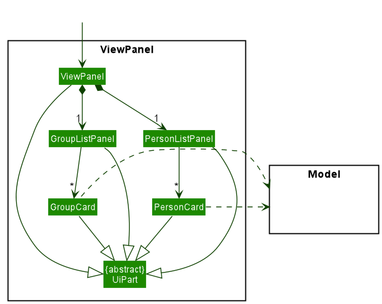

The `ViewPanel` consist of the following parts:
* `GroupListPanel`
* `ContactListPanel`
* `ExpenseListPanel`
* `TransactionSummary`
* `PaymentListPanel`

Each panel will display the corresponding list accordingly. The ViewPanel will only show up a single list panel at a time. 
We have decided to opt for this way of implementation due to the following:
* Able to make use of existing AB3 implementation of `PersonList`
* Will not increase code complexity as compared to both list using the same panel.
* Able to toggle easily with CLI commands

In addition to using CLI command, we will also be implementing the toggling of list panel with the use of buttons.

#### Navigation Buttons
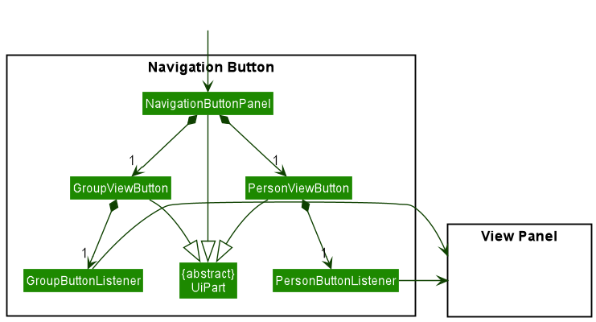

The `NavigationButtonPanel` consist of the following parts:
* GroupViewButton
* ContactViewButton

Clicking each button will show the respective list view in `ViewPanel`. The clicking of the button is handled by `EventHandler`.

### Logic component

**API** : [`Logic.java`](https://github.com/AY2122S1-CS2103T-F13-1/tp/tree/master/src/main/java/seedu/awe/logic/Logic.java)

Here's a (partial) class diagram of the `Logic` component:

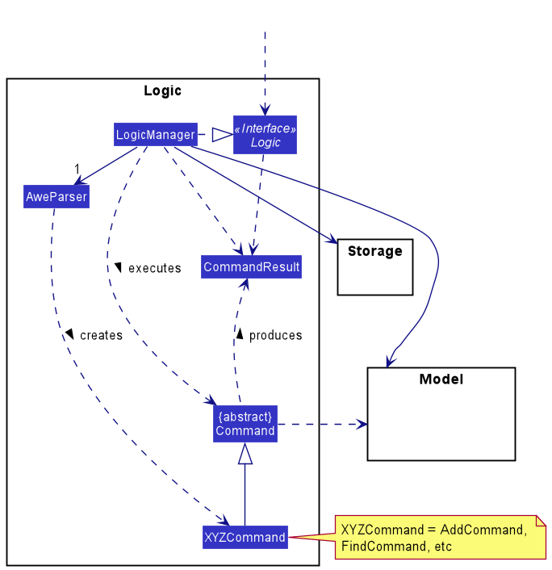

How the `Logic` component works:
1. When `Logic` is called upon to execute a command, it uses the `AweParser` class to parse the user command.
1. This results in a `Command` object (more precisely, an object of one of its subclasses e.g., `AddCommand`) which is executed by the `LogicManager`.
1. The command can communicate with the `Model` when it is executed (e.g. to add a contact).
1. The result of the command execution is encapsulated as a `CommandResult` object which is returned back from `Logic`.

The Sequence Diagram below illustrates the interactions within the `Logic` component for the `execute("delete 1")` API call.

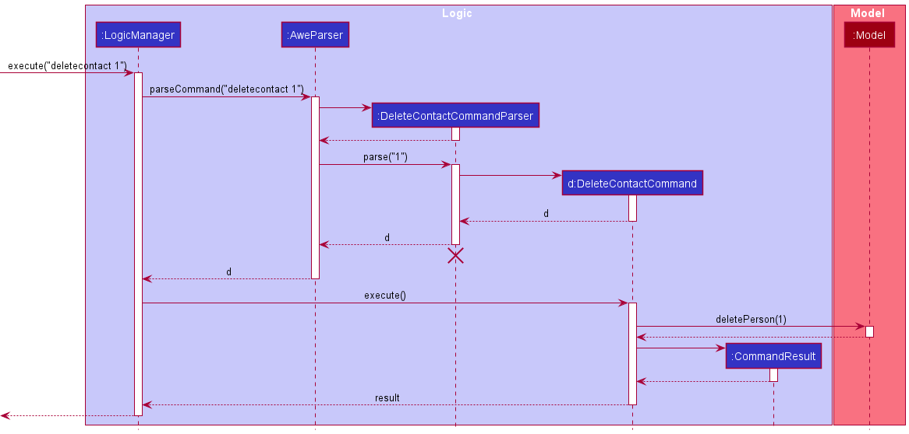

<div markdown="span" class="alert alert-info">:information_source: **Note:** The lifeline for `DeleteCommandParser` should end at the destroy marker (X) but due to a limitation of PlantUML, the lifeline reaches the end of diagram.
</div>

Here are the other classes in `Logic` (omitted from the class diagram above) that are used for parsing a user command:

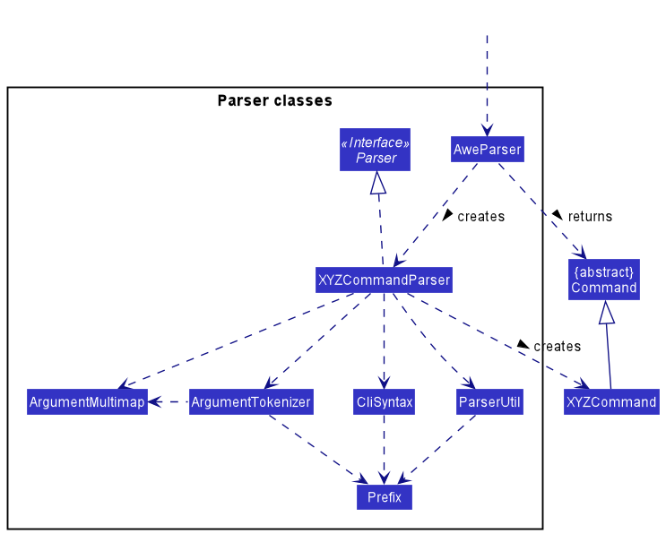

How the parsing works:
* When called upon to parse a user command, the `AweParser` class creates an `XYZCommandParser` (`XYZ` is a placeholder for the specific command name e.g., `AddCommandParser`) which uses the other classes shown above to parse the user command and create a `XYZCommand` object (e.g., `AddCommand`) which the `AweParser` returns back as a `Command` object.
* All `XYZCommandParser` classes (e.g., `AddCommandParser`, `DeleteCommandParser`, ...) inherit from the `Parser` interface so that they can be treated similarly where possible e.g, during testing.

### Model component
**API** : [`Model.java`](https://github.com/AY2122S1-CS2103T-F13-1/tp/tree/master/src/main/java/seedu/awe/model/Model.java)

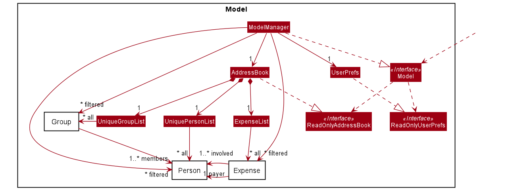
<br>
(Note: Implementation of Person, Group and Expense class diagram are referenced below.)

The `Model` component,

* stores AWE data
    * all `Person` objects (which are contained in a `UniquePersonList` object).
    * all `Group` objects (which are contained in a `UniqueGroupList` object).
    * all `Expense` objects (which are contained in a `ExpenseList` object).
    * all `TransactionSummary` objects (which are contained in a `TransactionSummaryList` object).
    * all `Payment` objects (which are contained in a `PaymentList` object).
* stores the currently 'selected' `Person`/`Group`/`Expense`/`TransactionSummary` /`Payment` objects (e.g., results of a search query) as a separate _filtered_ list which is exposed to outsiders as an unmodifiable `ObservableList<>` that can be 'observed' e.g. the UI can be bound to this list so that the UI automatically updates when the data in the list change.
* stores a `UserPref` object that represents the user’s preferences. This is exposed to the outside as a `ReadOnlyUserPref` objects.
* does not depend on any of the other three components (as the `Model` represents data entities of the domain, they should make sense on their own without depending on other components)

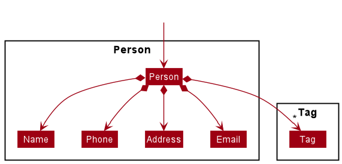
<br>

The `Person` component, 

*  Handles the storing of each contact in AWE.
*  Stores a `Name` and a `Phone` object for each person.
*  Stores any amount of `Tag` objects.

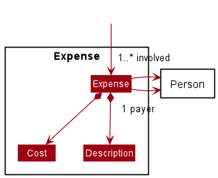
<br>

The `Expense` component, 

*  Handles the storing of each expense in AWE.
*  Expenses will store a reference to all instance of `Person` involved in the expenses.
*  Stores a `Cost` and a `Description` for each `Expense`.

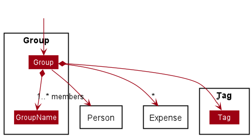<br>

The `Group` component, 

*  Handles the data of each group in AWE.
*  Groups will store a list of reference to all `Expense` and `Person` in the group.
*  Stores a `GroupName` for each group.
*  Stores any amount of `Tag` object.

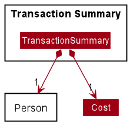
<br>

The `TransactionSummary` component,

*  Handles the display of all the individual split expenses in a group.
*  Stores a reference to a `Person` and a `Cost`.


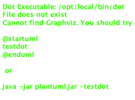
<br>

The `Payment` component,

*  Handles the display of all the payments to be made between contacts in a group.
*  Stores 2 `Person` objects and a `Cost`.

### Storage component

**API** : [`Storage.java`](https://github.com/AY2122S1-CS2103T-F13-1/tp/tree/master/src/main/java/seedu/awe/storage/Storage.java)

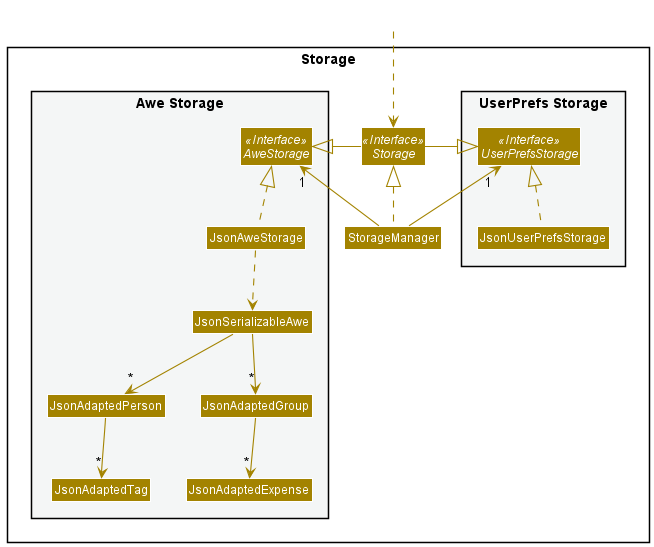

The `Storage` component,
* can save both AWE data and user preference data in json format, and read them back into corresponding objects.
* inherits from both `AweStorage` and `UserPrefStorage`, which means it can be treated as either one (if only the functionality of only one is needed).
* depends on some classes in the `Model` component (because the `Storage` component's job is to save/retrieve objects that belong to the `Model`)

### Common classes

Classes used by multiple components are in the `seedu.awe.commons` package.

--------------------------------------------------------------------------------------------------------------------

## **Implementation**

This section describes some noteworthy details on how certain features are implemented.

**Note: The words contact and person will be used interchangeably in this section.** 

### Add Contact Feature

The add contact mechanism is facilitated by defining a Person model and adding a Unique Person List field to
AWE. The Person model contains a `Name` field containing the name of the contact, a `Phone` field containing the
number of the contact, and optional `Tags` to attach to the contact.

The following activity diagram shows what happens when a user executes a `createGroup` command.

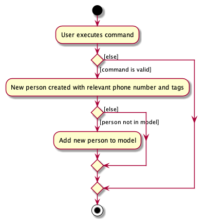

Given below is an example usage scenario and how the `creategroup` mechanism behaves at each step.

Step 1. A valid `addcontact` command is given as user input. This prompts the `LogicManager` to run its execute()
method.

Step 2. The `AddContactCommandParser` parses the input and checks for presence of the relevant prefixes.
It also checks that the name is valid and all members specified are in the contact list.
It returns a `AddContactCommand`.

Step 3. `AddContactCommand` runs its execute() method which checks if a contact with the same name has already been
created. If not, the newly created contact is added into the AWE model. Upon successful execution, `CommandResult` is returned.

The following sequence operation shows how the `addcontact` operation works.
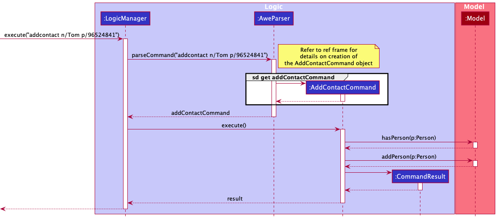

<div markdown="span" class="alert alert-info">:information_source: **Note:** The lifeline for `AddContactCommandParser`
should end at the destroy marker (X) but due to a limitation of PlantUML, the lifeline reaches the end of diagram.
</div>

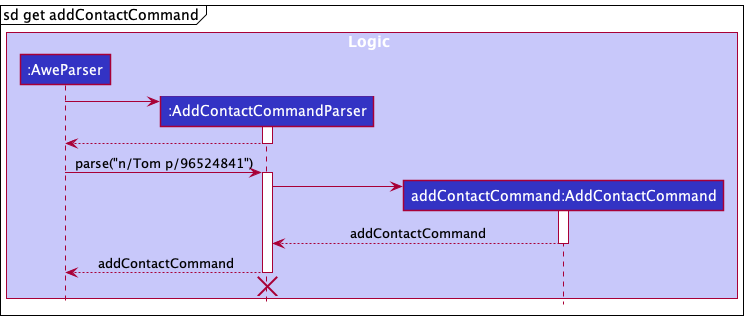

#### Design considerations:

**Aspect: Case-sensitivity of `Name` parameter in `addcontact` command:**

* **Alternative 1 (current choice):** `Name` is case-sensitive (for instance, `Alex` and `alex` are treated as unique names, and effectively, unique persons as well).
  * Pros: Easy to implement.
  * Pros: Many cultures have names that are common. Allowing users to enter the same name but in different case allows unique users with the same name to store their contacts.
  * Pros: Many cultures have names that are spelled in different case. For instance, in Singapore, the characters "s/o" (often used to denote "son of") are spelled in different case by different people. Should multiple users have the same name but different case-spelling, it would be respectful to accept all versions of the name, regardless of case.
  * Pros: Provides the user with a greater level of flexibility and user-choice.
  * Cons: Possibility of user referring to the wrong person in commands due to creation of multiple persons with the same names but in different case.


* **Alternative 2 :** `Name` is not case-sensitive.
  * Pros: Difficult to implement.
  * Pros: Safeguards user from erroneously referring to the wrong person in commands.
  * Cons: Difficult for users with the same name.
  * Cons: May offend some people if the casing of their name is regarded as unacceptable or not given recognition.
  * Cons: User has limited flexibility and restricted user-choice.


* **Justification**
  * The two cases described in the alternatives, where multiple persons of the same name but different case are necessary, are quite prevalent.
  * Moreover, we trust the user to be careful with the casing of the `Name` when entering the commands.
  * As such, we chose to make the `Name` parameter case-sensitive.
  

### Create Group Feature

The create group mechanism is facilitated by defining a Group model and adding a Unique Group List field to 
AWE. The Group model contains a `GroupName` field containing the name of the group, an `ArrayList` of `Person`
objects who are members of the Group, an `ArrayList` of `Expense` objects that keeps track of the expenditures of the 
Group, a `HashMap` that contains details of how much each member has paid in total across the expenses, and a `HashMap`
that contains details of the total expenditure incurred by each member across the trip.

The following activity diagram shows what happens when a user executes a `createGroup` command.

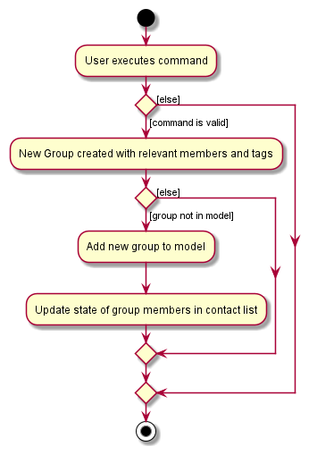

Given below is an example usage scenario and how the `creategroup` mechanism behaves at each step.

Step 1. A valid `creategroup` command is given as user input. This prompts the `LogicManager` to run its execute()
method.

Step 2. The `CreateGroupCommandParser` parses the input and checks for presence of the relevant prefixes.
It also checks that the group name is valid and all members specified are in the contact list.
It returns a `CreateGroupCommand`.

Step 3. `CreateGroupCommand` runs its execute() method which checks if a group with the same name has already been
created. If not, the newly created group is added into the AWE model and all members within the group are updated in
the model. Upon successful execution, `CommandResult` is returned.

The following sequence operation shows how the `creategroup` operation works.
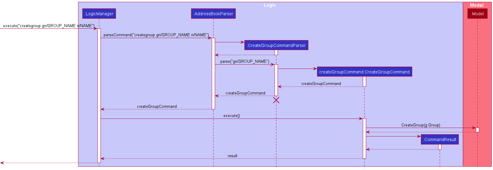

<div markdown="span" class="alert alert-info">:information_source: **Note:** The lifeline for `CreateGroupCommandParser`
should end at the destroy marker (X) but due to a limitation of PlantUML, the lifeline reaches the end of diagram.
</div>

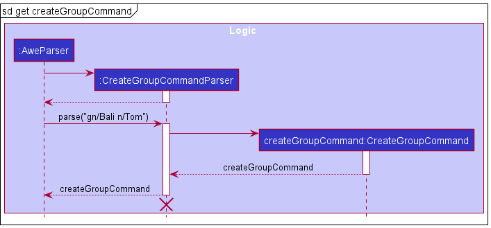

#### Design considerations:

**Aspect: User command for `creategroup`:**

* **Alternative 1 (current choice):** Create Travel Group with specified members and tags.
    * Pros: Intuitive for user to create a travel group with specified members and tags.
    * Pros: Provides user with convenience of setting up a travel group with minimal commands.
    * Cons: Harder to implement.
    * Cons: Easier for user to make an erroneous command.


* **Alternative 2 :** Create Travel Group only.
    * Pros: Easy to implement.
    * Pros: Command has single responsibility. Easy to remember the sole purpose of `creategroup` command.
    * Cons: Unintuitive for user as travel group is created without any members or tags.
    * Cons: Inconvenient for user to use multiple commands to set up a travel group.


* **Justification**
    * User will have at least one member in mind when creating a group.
    * As such, it is only natural for the `creategroup` command to support addition of members and tags into the group
      upon creation.
    * This minimizes the number of commands a user has to make in setting up a functional Group.
    * As such, it is better to choose Alternative 1, as this provides the user with a far better user experience.

**Aspect: Case-sensitivity of `GroupName` parameter in `creategroup` command:**

* **Alternative 1 (current choice):** `GroupName` is case-sensitive (for instance, `BALI` and `bali` are treated as unique group names, and effectively, unique groups as well).
  * Pros: Easy to implement.
  * Pros: If the user goes on multiple trips to the same place, they can keep track of multiple groups by adding multiple groups of a similar name, different by case.
  * Pros: If multiple groups of users go on trips to the same place, they can keep track of multiple trips by adding multiple groups of a similar name, different by case.
  * Pros: Provides the user with a greater level of flexibility and user-choice.
  * Cons: Possibility of user referring to the wrong group in commands due to creation of multiple-groups with the same names but in different case.


* **Alternative 2 :** `GroupName` is not case-sensitive.
  * Pros: Difficult to implement.
  * Pros: Safeguards user from erroneously referring to the wrong group in commands.  
  * Cons: Difficult for users who go on a trip to the same place multple times to keep track of their trips.
  * Cons: Difficult to keep track of trips or groups if multiple groups of users go on trips to the same place.
  * Cons: User has limited flexibility and restricted user-choice.


* **Justification**
  * The two cases described in the alternatives, where multiple groups of the same name are necessary, are quite prevalent.
  * Moreover, we trust the user to be careful with the casing of the `GroupName` when entering the commands.
  * As such, we chose to make the `GroupName` parameter case-sensitive.
  

* **Improvements**
  * The solution of making the `GroupName` parameter case-sensitive to permit users to create groups of the same name should the use case demand it is not ideal.
  * In the long-term, we plan to make `GroupName` case-insensitive, but this will require changes to the command.  
  * One such change currently being worked on is to include a `DATETIME` parameter for this command, so that users who go on multiple trips to the same location at different times can keep track of their trips.
  * Other solutions are necessary to satisfy the use case wherein different sets of members wish to go on a trip to the same location at the same time and wish to create groups of the same name.
  * A solution that is being considered is to check for uniqueness of the group by checking that the members in each group are different.
  * However, this will require changes to other commands as presently most commands operate on the assumption that `GroupName` is unique (case-sensitivity considered).


### Delete Group Feature

The delete group mechanism is facilitated by maintaining the constraint that every `Group` has a unique `GroupName`.
This allows the `Model` class to easily retrieve the Group based on the name entered by the user and remove the group from the model.

The following activity diagram shows what happens when a user executes a `deletegroup` command.

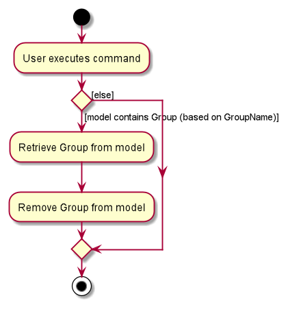


Given below is an example usage scenario and how the `deletegroup` mechanism behaves at each step.

Step 1. A valid `deletegroup` command is given as user input. This prompts the `LogicManager` to run its execute()
method.

Step 2. The `DeleteGroupCommandParser` parses the input and checks for presence of the relevant prefixes.
It also checks that the group name is valid (does not have any non-alphanumeric characters).
It returns a `DeleteGroupCommand`.

Step 3. `DeleteGroupCommand` runs its execute() method which checks if a group with the same name has been
created in the past. If so, this group is retrieved from the model. Subsequently, the group is removed from the AWE.
Upon successful execution, `CommandResult` is returned.


The following sequence operation shows how the `deletegroup` operation works.
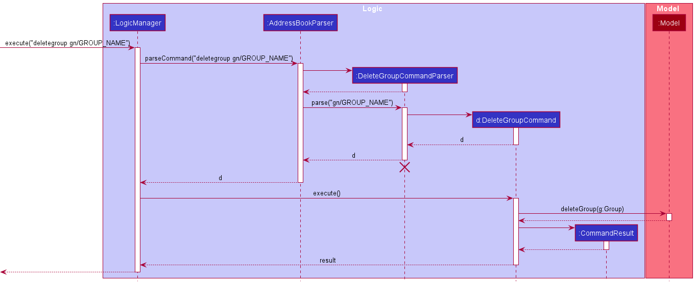

<div markdown="span" class="alert alert-info">:information_source: **Note:** The lifeline for `DeleteGroupCommandParser` should end at the destroy marker (X) but due to a limitation of PlantUML, the lifeline reaches the end of diagram.
</div>

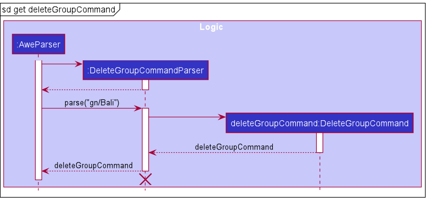

#### Design considerations:

**Aspect: User command for deletegroup:**

* **Alternative 1 (current choice):** Delete based on `GroupName`.
    * Pros: Easy to implement.
    * Pros: Difficult for user to make an erroneous command.
    * Cons: Long user command.  
    * Cons: Requires imposition of constraint that group names are unique.
    

* **Alternative 2 (index based):** Delete based on index position in `ObservableList`.
    * Pros: Easy to implement.
    * Pros: Short user command  
    * Cons: Unintuitive for user.
    * Cons: Easy for user to make an erroneous command.
    

* **Justification**
    * Group contains large mass of information such as multiple expenses, individual expenditures, and payments.
    * This information is unrecoverable once deleted.
    * As such, it is better to choose Alternative 1, as this makes it difficult for user to accidentally delete a group.

**Aspect: Internal delete mechanism:**

* **Alternative 1 (current choice):** Retrieve group from list and delete.
  * Pros: Easy to implement.
  * Pros: Easier to modify in future.
  * Cons: Extra step of retrieval leads to slower execution.
  

* **Alternative 2 (name based):** Delete based on `GroupName`.
  * Pros: Easy to implement.
  * Pros: Process is completed faster.
  * Cons: Might cause issues in case of future modifications.
  

* **Justification**
  * Retrieving the group and subsequently deleting the group is a slower process.
  * However, the alternative implementation relies on the uniqueness of the `GroupName` field of `Group` objects.
  * Should we modify or remove the constraint, the alternative implementation would require significant alterations.
  * To make the feature more extendable, we choose alternative 1.

### Group Edit Features
The group edit mechanism is facilitated by defining a Group model and adding a Unique Group List field to
AWE. The Group model contains a `GroupName` field containing the name of the group, an `ArrayList` of `Person`
objects who are members of the Group, an `ArrayList` of `Expense` objects that keeps track of the expenditures of the
Group. The group edit mechanism comprises the following commands. 
* `groupeditname`
* `groupaddcontact`
* `groupremovecontact`
* `groupaddtag`
* `groupremovetag`

Given the high degree of similarity in implementation and design considerations between these commands, only the
`groupeditname` command will be explained comprehensively in this section.

Given below is an example usage scenario and how the `groupeditname` command behaves at each step.

Step 1. A valid `groupeditname` command is given as user input. This prompts the `LogicManager` to run its execute()
method.

Step 2. The `GroupEditNameCommandParser` parses the input and checks for presence of the relevant prefixes.
It also checks that both the old and new group names are valid.
It returns a `GroupEditNameCommand`.

Step 3. `GroupEditNameCommand` runs its execute() method which updates the name of the group in the AWE model.
Upon successful execution,`CommandResult` is returned.

The following sequence operation shows how the `groupeditname` command works.
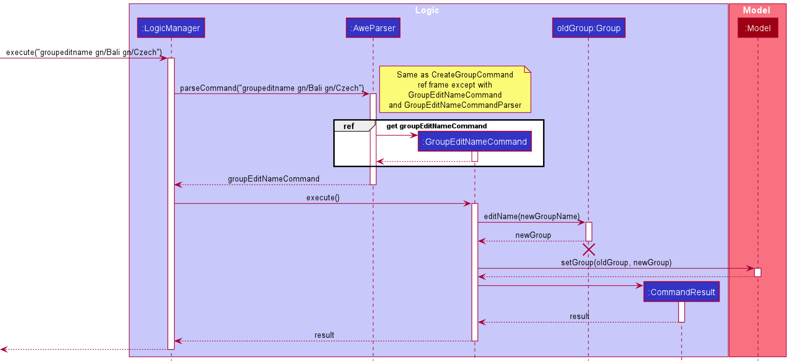

<div markdown="span" class="alert alert-info">:information_source: **Note:** The lifeline for `oldGroup:Group`
should end at the destroy marker (X) but due to a limitation of PlantUML, the lifeline reaches the end of diagram.
</div>

#### Design considerations:

**Aspect: User command for `groupeditname`:**

* **Alternative 1 (current choice):** Edit each attribute of a group with separate commands.
  * Pros: Significantly shorter commands.
  * Pros: Provides user with convenience of editing a group with minimal input.
  * Cons: More commands for user to work with. Harder to remember relevant commands.

* **Alternative 2 :** Edit groups with a single command, as is implemented in `editcontact`.
  * Pros: Easy to implement.
  * Cons: Inconvenient for user to edit a person if there are multiple attributes they wish to change.
  * Cons: Easy for user to make an erroneous command.

* **Justification**
  * Unlike Person objects, Group objects have many more attributes that users may wish to change.
  * The length of a single edit command that can change all attributes will be extremely long if a user wishes to add
  and remove multiple members simultaneously.
  * This significantly increases the chances of users inputting erroneous commands as well
  * Hence, editing attributes of a group using separate commands is more convenient and appropriate.

### Find group feature

The find group feature supports both single keyword and multi keyword search. This allows the displayed view panel to show the entries related to the search keywords entered by the user.

The following activity diagram shows what happens when a user executes a `findgroups` command:

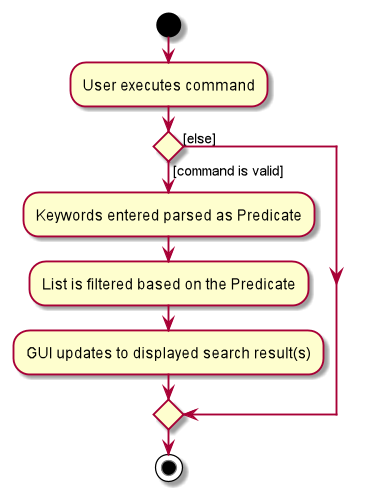

Given below is an example usage scenario and how the `findgroup` operation behaves at each step:

Assuming the programs only have the initial data when the user first starts the app, the `FilteredList` should contain only 2 groups - London and Bali.

Step 1. When the user executes `findgroups London` command, the message is passed into `LogicManager` and parsed by `AweParser`.

Step 2. `FindGroupsCommandParser` is created and the arguments are parsed by it. The arguments are used to create `GroupContainsKeywordsPredicate` and `FindGroupsCommand` is returned to the `LogicManager`.

Step 3. The `LogicManager` then calls `FindGroupCommand#execute(model)` method, which updated the `FilteredList<Group>` in `ModelManager`. Thereafter, the `FilteredList<Group>` should contains only London.

Step 4. The GUI listens for updates in the `FilteredList<Group>` and updates the display to display London only.

Step 5. `CommandResult` is returned to the `LogicManager`, which also switches the view panel to `GroupsListPanel` if needed. See UI implementation below for more details of switching view panel.

Step 6. The output from `CommandResult` is then displayed as an output for the user.

The following sequence diagram shows how the `findgroups` operation works:

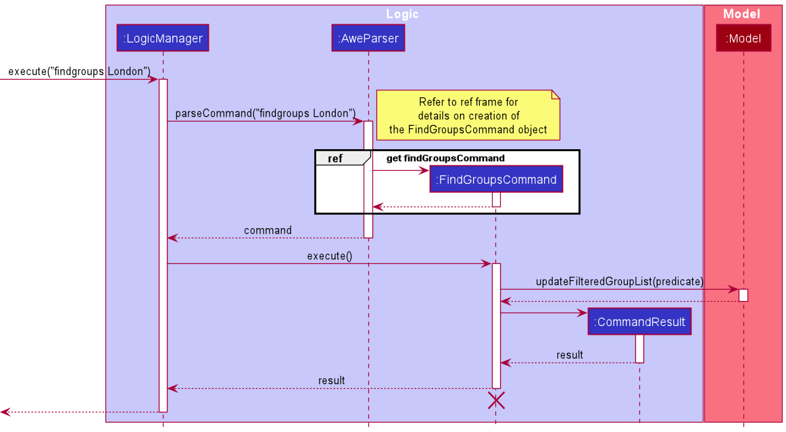

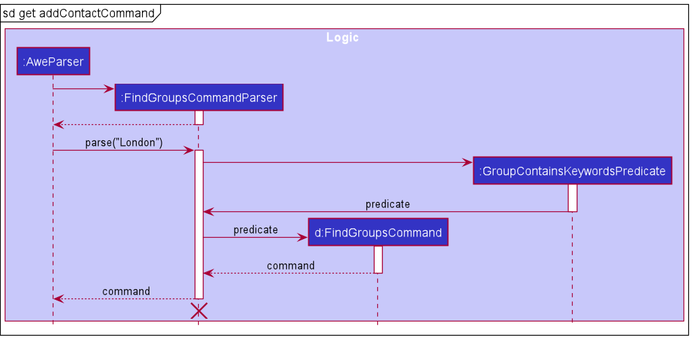

### Add expense feature

The add expense mechanism is facilitated by defining an Expense model and adding an Expense List field to
`Awe`. The Expense model contains a `Person` field containing the payer of the Expense, a `Cost` field
containing the cost of the expense, a `List` of `Person` objects that keeps track of the people involved in the
expense, a `HashMap` that contains details of how much each member has paid in total for the expense.

The following activity diagram shows what happens when a user executes a `addexpense` command.

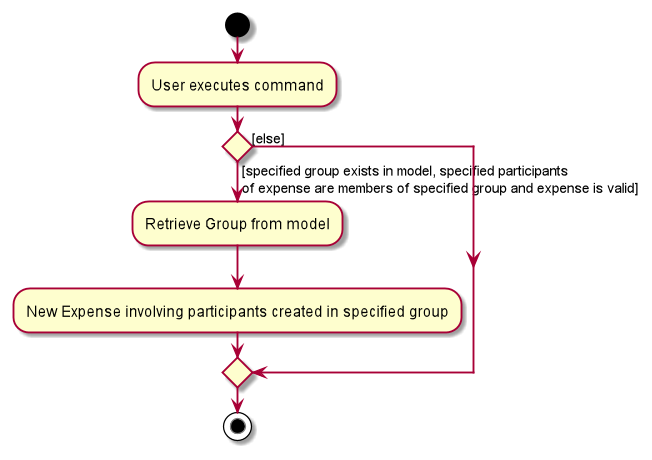

Given below is an example usage scenario and how the `addexpense` mechanism behaves at each step.

Step 1. A valid `addexpense` command is given as user input. This prompts the `LogicManager` to run its execute()
method.

Step 2. The `AddExpenseCommandParser` parses the input and checks for presence of the relevant prefixes.
It also checks that the group name is valid and all members specified are in the specified group.
It returns a `AddExpenseCommand`.

Step 3. `AddExpenseCommand` runs its execute() method which adds the newly created expense involving the into the
relevant group members into the group and the group is updated in the AWE model.Upon successful execution,
`CommandResult` is returned.

The following sequence operation shows how the `addexpense` operation works.
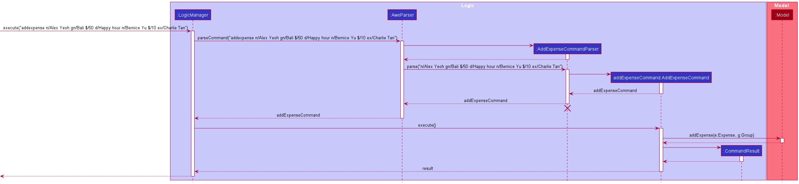

<div markdown="span" class="alert alert-info">:information_source: **Note:** The lifeline for `AddExpenseCommandParser`
should end at the destroy marker (X) but due to a limitation of PlantUML, the lifeline reaches the end of diagram.
</div>

#### Design considerations:

**Aspect: User command for `addexpense`:**

* **Alternative 1 (current choice):** Create Expense with specified group and group members.
    * Pros: Intuitive for user to create an expense with specified group and group members via their names.
    * Pros: Provides user with convenience of creating an expense with minimal input.
    * Cons: Harder to implement.
    * Cons: Easier for user to make an erroneous command.


* **Alternative 2 (index based):** Create Expense with based on index position in `ObservableList`.
    * Pros: Easy to implement.
    * Cons: Inconvenient for user to add an expense as they have to check again the index of both the person and group.
    * Cons: Easy for user to make an erroneous command.

* **Justification**
    * Each person has a unique name and the implementation for adding an expense based on a person's and group's 
      name is simple.
    * Users may need a long time to find the index of a person or group if the list of either is very long.
    * Hence, adding expenses based on the specified person and group name is more appropriate.

### Find Expenses Feature

The find expenses mechanism is facilitated by `Group`. Each group has a unique group name and also an expense list 
required for finding expenses within a group.

The following activity diagram shows what happens when a user executes a `findexpenses` command.

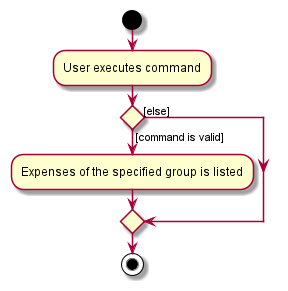

Given below is an example usage scenario and how the `findexpenses` mechanism behaves at each step.

Step 1. The user executes a valid `findexpenses eat gn/London` command. This prompts the `LogicManager` 
to run its execute() method.

Step 2. The `FindExpensesCommandParser` parses the input and checks for presence of the group name prefix.
It also checks that the group name is valid (does not have any non-alphanumeric characters). The arguments are 
used to create `DescriptionContainsKeywordsPredicate` and `FindExpensesCommand` is returned to the `LogicManager`.

Step 3. The `LogicManager` then calls `FindExpensesCommand#execute(model)` method, which updates the 
`FilteredList<Expense>` in `ModelManager` using the predicate created in step 2.

Step 4. The GUI listens for updates in the `FilteredList<Expense>` and updates the display accordingly.

Step 5. `CommandResult` is returned to the `LogicManager`, which also switches the viewpanel to `ExpensesListPanel` if needed.

Step 6. The output from `CommandResult` is then displayed as an output for the user.


The following sequence operation shows how the `findexpenses` operation works.
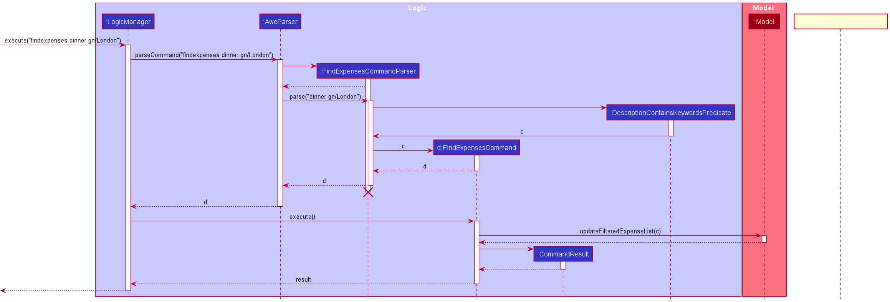

<div markdown="span" class="alert alert-info">:information_source: **Note:** The lifeline for `DeleteGroupCommandParser` should end at the destroy marker (X) but due to a limitation of PlantUML, the lifeline reaches the end of diagram.
</div>

#### Design considerations:

**Aspect: User command for findexpenses:**

* **Alternative 1 (current choice):** Find based on `GroupName`
    * Pros: Easy to implement.
    * Cons: Long user command if group name is long.
    * Cons: Requires imposition of constraint that group names are unique.


* **Alternative 2 (index based):** Find expenses in the group indicated by index position in `ObservableList`
    * Pros: Short user command with just the index.
    * Cons: User need to check for the right index of the group.
    * Cons: Easy for user to make an erroneous command.


* **Justification**
    * Each group has a unique name and the implementation for finding a group based on the group name is simple. 
    * Users may need a long time to find the index of a group if the list of groups is very long.
    * Hence, finding expenses based on the specified group name is more appropriate.


### Delete Expense Feature

The delete expense mechanism is facilitated by the addition of an `ExpenseList` field within the `Awe` object maintained by the model.
Each `Expense` belongs to a `Group` object, also maintained within the `Awe`.
Deletion of an expense must be accompanied by deletion of the expense from the `Group` object to which it belongs.
The command allows the user to delete an expense based on the index position of the expense in the page viewed by the user.
This means that the user is constrained to only being permitted to delete expenses when they are viewing a list of expenses; that is, after they enter the `findexpenses` or `expenses` command.

The following activity diagram shows what happens when a user executes a `deleteexpense` command.

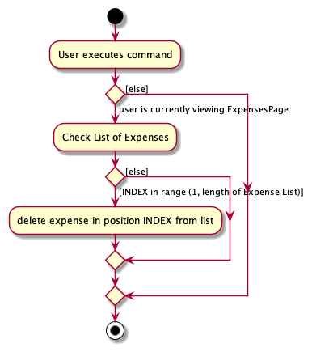

Given below is an example usage scenario and how the `deleteexpense` mechanism behaves at each step.

Step 1. A valid `deleteexpense` command is given as user input. This prompts the `LogicManager` to run its execute()
method.

Step 2. The `DeleteExpenseCommandParser` parses the input and checks for presence of the `INDEX` input.
It returns a `DeleteExpenseCommand`.

Step 3. `DeleteExpenseCommand` runs its execute() method which checks if the `INDEX` entered is within the range of the size of the list of expneses seen by the user.
If so, the `Expense` at the `INDEX` position is deleted from the `ExpenseList`. The `ObservableList` within `ExpenseList` is updated, meaniing the UI updates and the user can see the new list of expenses, without the deleted expense.

Step 4. The `Group` to which this expense belongs is retrieved from the `ExpenseList`.
The expense is subsequently deleted from the `expenses` field present in the `Group` object.
The updated `Group` is then placed back into the `GroupList` within the `Awe`.

Step 5: Upon successful execution, `CommandResult` is returned.


The following sequence operation shows how the `deleteexpense` operation works.
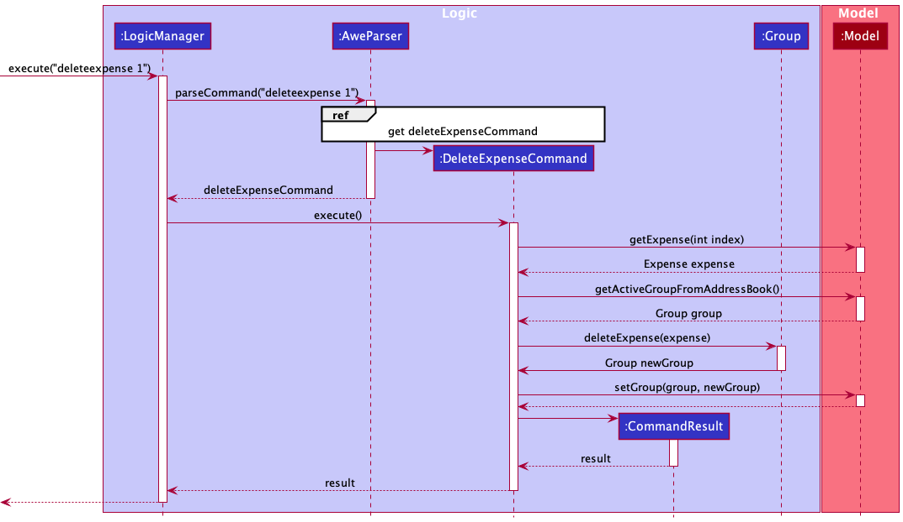

<div markdown="span" class="alert alert-info">:information_source: **Note:** The lifeline for `DeleteExpenseCommandParser` should end at the destroy marker (X) but due to a limitation of PlantUML, the lifeline reaches the end of diagram.
</div>

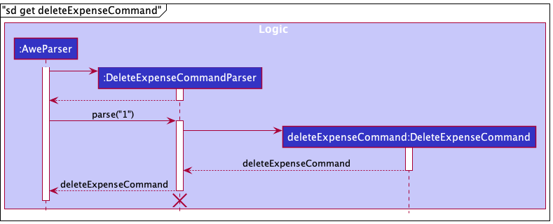

#### Design considerations

**Aspect: User command for deleteexpense:**

* **Alternative 1 (current choice):** Delete based on index position in `ObservableList`
    * Pros: Easy to implement.
    * Pros: Short user command.
    * Cons: Less intuitive for user.
    * Cons: Easy for user to make an erroneous command.

* **Alternative 2 (description based):** Delete based on `description`
    * Pros: Easy to implement.
    * Pros: Difficult for user to make an erroneous command.
    * Cons: Long user command.
    * Cons: Requires imposition of constraint that expense description names are unique.


* **Justification**
    * Expenses, unlike Groups, do not contain a large volume of information.
    * This information is unrecoverable once deleted.
    * However, the damage to a user as a result of an error is not significant. The user can re-enter the details with a single command.
    * Therefore, the need to protect the user from erroneous decisions is not significant.
    * Furthermore, many expenses are likely to have similar descriptions. Constraining users to using unique descriptions for expenses is likely to compromise the user experience.
    * As such, it is better to choose Alternative 1, as this allows the user to quickly delete expenses, and not compromise on the flexibility of the user.

### Calculate Payments Feature

The purpose of this feature is to provide users with a simple set of transactions that would allow all debts within the group to be settled.
The UI mechanism is facilitated by the addition of a `PaymentList` field of `Payment` objects, present within the `Awe` object maintained by the model.
The functionality of this feature is facilitated by the fact that group objects maintain two hashmaps: -
* `paidByPayers`, which maintains how much each member of the group has paid (total payments) during the course of the trip.
* `splitExpenses`, which maintains how much expenditure each member of the group has incurred (total expenditure) during the course of the trip.
These maps allow calculations with respect to how much each individual is owed, and how much each individual owes.
  
#### The Algorithm
The invariant maintained is that the sum of all payments made (values within `paidByPayers`) should equal the total expenditures incurred by the group (values within `splitExpenses`).
Define surplus as the net amount each individual is owed by others. This ultimately means that some members have negative surplus, and some have positive surplus.
The goal is to ensure that the deficits balance the surpluses with the minimum number of transactions.
To assist with the tracking of each individual and their surplus, an inner `Pair` class was created with a `Person` field and a primitive double field for the surplus.

* Initialise an empty list of Pairs and an empty list of `Payment` objects.

* Iterate through the `members` of the group and retrieve each individual's total payments and total expenditures.

* Calculate the surplus of each individual by subtracting their total expenditures from their total payments.
Initialise a `Pair` object with the `Person` object of the individual, and their surplus. Add this pair to the list if the surplus is not 0.

* Iterate until the list is empty and perform the following steps.
  * Sort the list in ascending order of surplus. This means that those who owe more are placed in the earlier part of the list and those who are owed more are placed towards the end of the `Pair` list.
  * Retrieve the first `Pair` and last `Pair` in the list. It is invariant that the first pair will have negative surplus and the last pair will have positive surplus.
  * Check to see which pair has a smaller magnitude. Define this value to be `SMALL_VAL`.
  * Create a `Payment` object with a `Cost` of `SMALL_VAL`, and payee and payer as the two individuals within the first pair and last pair retrieved respectively. Add this `Payment` object to the list of `Payment` objects.
  * If the pairs do not have equal magnitude, remove the pair with the surplus value of smaller magnitude from the list. Calculate the new surplus value of the other pair to be the sum of the surpluses of both pairs. Update the other pair with this new surplus value and place it back into the list.
  * If the pairs do have equal magnitude, remove both pairs from the list.
  
* Return the list of `Payment` objects.

The following diagram shows the flow of the algorithm.

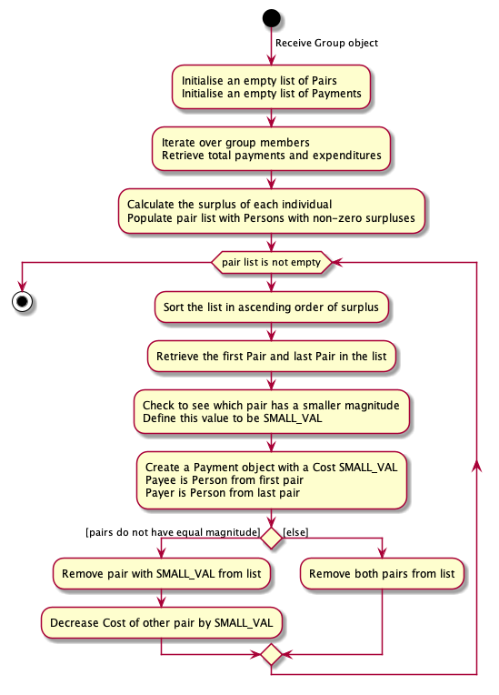
  

The following activity diagram shows what happens when a user executes a `calculatepayments` command.

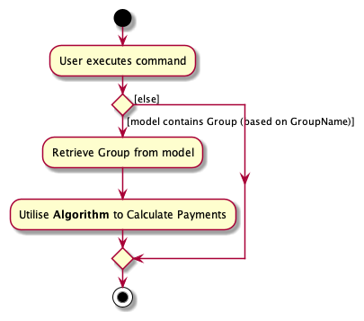

Given below is an example usage scenario and how the `calculatepayments` mechanism behaves at each step.

Step 1. A valid `calculatepayments` command is given as user input. This prompts the `LogicManager` to run its execute()
method.

Step 2. The `CalculatePaymentsCommandParser` parses the input and checks for presence of the `GROUP_NAME` prefix.
It checks that the `GROUP_NAME` is valid (does not have any non-alphanumeric characters).
It returns a `CalculatePaymentsCommand`.

Step 3. `CalculatePaymentsCommand` runs its execute() method which checks if a group with the `GROUP_NAME` entered by the user has been
created in the past. If so, this group is retrieved from the model.

Step 4. Subsequently, the **Algorithm** is used to tabulate a list of `Payment` objects.

Step 5. The `PaymentList` field is updated with the generated list of payments, triggering a change in the UI to show the user the list of payments.

Step 6. Upon successful execution, `CommandResult` is returned.


The following sequence operation shows how the `calculatepayments` operation works.
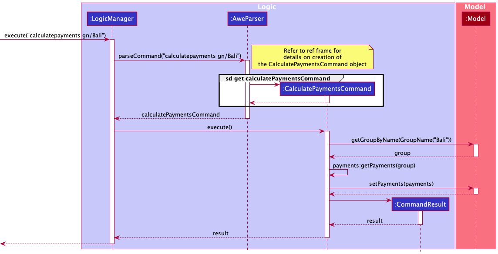

<div markdown="span" class="alert alert-info">:information_source: **Note:** The lifeline for `CalculatePaymentsCommandParser` should end at the destroy marker (X) but due to a limitation of PlantUML, the lifeline reaches the end of diagram.
</div>


**Note: When a `Person` is deleted from contacts or removed from the group, the functioning of this command does not change. The deleted person may still be part of the list of payments depending on the expenses they had previously.**

#### Design considerations

**Aspect: Algorithm utilised for calculatepayments:**

* **Alternative 1 (current choice):** Prioritise settling of bigger debts 
    * Pros: Easy to implement.
    * Pros: Smaller number of transactions.
    * Cons: Larger value transactions.

* **Alternative 2:** Prioritise settling of smaller debts
    * Pros: Smaller value transactions.
    * Cons: Greater number of transactions.
    * Cons: More difficult to implement.

* **Justification**
    * The size of the transaction matters less to the user than the volume of transactions.
    * Moreover, an easier implementation reduces the possibility of bugs.
    * As such, we chose to prioritise the settling of bigger debts in our algorithm.
  

### UI
AWE has multiple lists / views to display such as for `groups`, `contacts` and `expenses`.

The display, called view panel, will only be able to show up 1 view at a time depending on the command. It is of upmost importance to get it to display the correct view.

To achieve the toggling between each view panels, we implemented the following:
* An enumeration `UiView` to contain the following `CONTACT_PAGE`, `GROUP_PAGE`, `EXPENSE_PAGE`, `TRANSACTION_SUMMARY`, `PAYMENT_PAGE`. Each enum represents a different view.
* `CommandResult` was given 6 more boolean fields, each representing a different view as well.
* `MainWindow` checks for the 6 boolean fields in `CommandResult` and passes `UiView` to `ViewPanel` for toggling the view.

The following activity diagram shows how the `MainWindow` checks and sends the `UiView` to `ViewPanel`. 
<br>
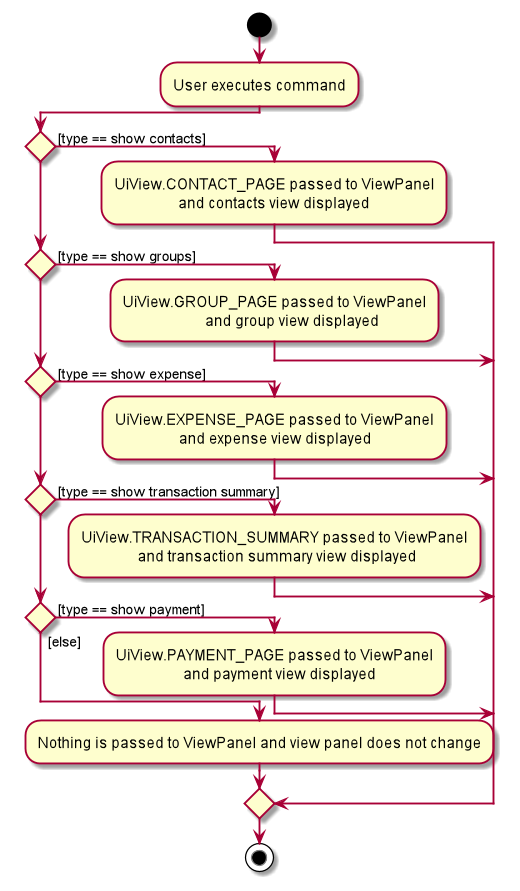

#### Proposed Implementation
**Aspect: Navigating between different view**

* **Alternative 1**: Make use of JavaFx's tab
    * Pros: Easy to implement.
    * Cons: Unable to fully customised the layout. Have to use the standard JavaFx's tab layout.
  
* **Alternative 2 (current choice)**: Replacing the child of the view panel node<br>
    (Refer to [JavaFx tutorial](https://se-education.org/guides/tutorials/javaFxPart1.html) for more information about JavaFx)
    * Pros: More customisable in terms of layout.
    * Pros: Able to make use of existing codes.
    * Cons: More classes to implement to handle the toggling between views.
    
* **Justification**
    * We want to place the command result display below the buttons according to our [wireframe](https://www.figma.com/file/VwuDOdHr7CSyDUWb4Kwkmx/CS2103T-tP?node-id=0%3A1).
    * Using JavaFx's tab will not let us customise the layout as such.
    * Hence, replacing the child of a view panel is more appropriate.
    
#### Ui Navigation Buttons
To improve the usability of AWE, buttons are implemented into the Ui to allow switching of view easily.

However, only 2 main views can be toggled by the buttons - Contacts page and Groups page.

Navigation Buttons is designed using Model View Controller (MVC) pattern. 
* View: Buttons
* Controller: EventHandler
* Model: Backend codes for displaying the list

To achieve this, the following is implemented:
* 2 buttons (`GroupViewButton` and `ContactViewButton`) for the user to click.
* Event listener for each button - `GroupButtonListener` and `ContactButtonListener`. The event listener works by calling `ViewPanel#toggleView` when the button is clicked.

Given below is an example usage scenario and how the button mechanism behaves at each step. In this example, the button used is `GroupViewButton` but it can also be replaced with `ContactViewButton`.

Step 1. When `GroupViewButton` is initiated, an event listener `GroupButtonListener` is created and used.

Step 2. Once the user clicks on `GroupViewButton`, the event listener will trigger and the `GroupButtonListener#handle` will run. This calls `ViewPanel#toggleView` and passes `UiView.GROUP_PAGE` as parameters. 

Step 3. `ViewPanel` will change the child of itself to `ContactListPanel` (Refer to [JavaFx tutorial](https://se-education.org/guides/tutorials/javaFxPart1.html) for more information about JavaFx). Hence, GUI will update to show contact page

--------------------------------------------------------------------------------------------------------------------

## **Documentation, logging, testing, configuration, dev-ops**

* [Documentation guide](Documentation.md)
* [Testing guide](Testing.md)
* [Logging guide](Logging.md)
* [Configuration guide](Configuration.md)
* [DevOps guide](DevOps.md)

--------------------------------------------------------------------------------------------------------------------

## **Appendix: Requirements**

### Product scope

**Target user profile**:

* travels in groups
* wants to split expenses in a convenient and efficient manner
* prefer desktop apps over other types
* can type fast
* prefers typing to mouse interactions
* is reasonably comfortable using CLI apps

**Value proposition**:

Travellers have big notes that make settling payments inconvenient.
Most travel groups often designate one person to pay.
This method of settling payments poses a vexing task of splitting costs at the end of the day or on-the-spot.
Our app effectively splits bills between different contacts to serve this purpose.


### User stories

Priorities: High (must have) - `* * *`, Medium (nice to have) - `* *`, Low (unlikely to have) - `*`

| Priority | As a …​                                            | I want to …​                                        | So that I can…​                                                           |
| -------- | ------------------------------------------------- | -------------------------------------------------- | ------------------------------------------------------------------------ |
| `* * *`  | beginner user who first opened the app            | view the help page                                 | so that I can learn how to use the app                                   |
| `* * *`  | user with contacts to remember                    | add a contact                                   | keep track of my contacts                                                |
| `* * *`  | user who has lots of contacts to keep track of    | view contacts                                      | easily see my contacts in one centralised location                       |
| `* * *`  | user who wants to find contacts with a certain string of characters in their name | find contacts by a regex                                 | search for contacts easily         |
| `* * *`  | user who has lots of contacts to keep track of    | tag a contact                                   | keep track of contacts by certain characteristics/tags                          |
| `* * *`  | user with contacts that no longer exist           | delete a contact                                 | keep my contacts relevant and current                                   |
| `* * *`  | user with contacts that have changed          | edit a contact                                 | keep my contacts accurate and current                                   |
| `* * *`  | user with a trip to go on                   | add a group                                   | keep track of my groups                                                |
| `* * *`  | user who has lots of trips to keep track of    | view groups                                      | easily see my groups in one centralised location                       |
| `* * *`  | user who wants to find groups with a certain string of characters in their name | find groups by a regex                                 | search for groups easily         |
| `* * *`  | user who has lots of groups to keep track of    | tag a group                                   | keep track of groups by certain characteristics/tags                          |
| `* * *`  | user with groups that no longer exist           | delete a group                                 | keep my groups relevant and current                                   |
| `* * *`  | user with flexible travel plans         | edit a group                                 | keep my groups accurate and current                                   |
| `* * *`  | user that has paid for a shared experience        | easily check how much I have paid up front         | ensure I have liquidity for emergencies and or other unforeseen expenses |
| `* * *`  | user who has paid for others                      | easily check how much I am owed by friends         | recoup the money I have paid on their behalf                             |
| `* * *`  | user paying for a shared expense                  | enter the amount I have paid                       | update the total amount they have to pay                                 |
| `* * *`  | user that owes my friend money                    | easily check how much I owe each person            | conveniently proceed to pay my friend                                    |
| `* * *`  | busy user who does not want to remember phone numbers | easily save all my friends' numbers            | conveniently proceed to pay my friend                                    |
| `* * *`  | user with flexible travel plans                   | edit the details of a trip/group (members, group name, tags)         | modify the records quickly and easily                                    |
| `* * *`  | beginner user                                     | run the app easily with a click of a button        | avoid wasting time trying to figure out how to get the app to work       |
| `* * *`  | inexperienced user in the app who types fast      | type in the commands for the app                   | do more things in the app with the same amount of time compared to using a mouse to click |
| `* * *`  | user who wants an easy workflow                   | easily toggle between contacts and groups page with a command or a click of a button | make my workflow on the app smoother   |
| `* *`    | user who has to recoup the money                  | divide up the expenses suitably amongst my friends | know how much to recoup from each person                                 |
| `* *`    | user who worries about individual expenses        | check the breakdown of my personal expenditure     | keep track of how much money I have spent                                |
| `* *`    | user who likes to differentiate work from leisure | use this app to separate the different types of contacts I have | I won’t mix them up                                         |
| `* *`    | user who wants to stay in contact with friends    | use this app to easily save their phone numbers    | I can remain in contact                                                  |
| `* *`    | potential user exploring the app                  | see the app containing sample data                 | see what the app generally looks like when it is used                    |
| `* *`    | potential user testing the app                    | run the app on different platforms (windows, linux and os-x) | not have to specifically run a certain platform                |
| `* `     | user whose friends frequently change numbers      | use this app to easily edit their numbers or save multiple numbers with notes | easily remember which number to use           |
| `*`      | beginner user that is tech-savvy                  | view the documentation                             | figure out how to use the app                                            |
| `*`      | beginner user                                     | easily distinguish functions in the app            | use it without the app being too daunting                                |
| `*`      | expert user                                       | refer to previous trips and the expenditure        | plan future trips efficiently                                            |

### Use Cases

(For all use cases below, the **System** is the `AWE` and the **Actor** is the `user`, unless specified otherwise)

#### Contacts Use Cases

**Use case: UC1 - Add a contact**

**MSS**

1. User chooses to add a contact to the AWE.
2. User enters add command into CLI along with contact name, phone number, and tags if applicable.
3. AWE displays confirmation message.
   <br>Use case ends.

**Extensions**

* 2a. AWE detects invalid command format that does not contain all 2 parameter identifiers ("n/", "p/").
    * 2a1. AWE returns invalid command format error and displays ```add``` command format and example.
      <br>Use case ends.
* 2b. Command contains 2 parameters identifiers but name is blank.
    * 2b1. AWE reminds user that names should only contain alphanumeric characters and should not be blank.
      <br>Use case ends.
* 2c. Command contains 2 parameters identifiers but phone number is less than 3 digits or not a number.
    * 2c1. AWE reminds user that phone numbers should only contain numbers and be at least 3 digits long.
      <br>Use case ends.

**Use case: UC2 - Delete a contact**

**MSS**

1. User <ins>finds contacts (UC4)</ins> or <ins>views all contacts (UC5)</ins>
2. User requests to delete a specific contact in the list.
3. AWE deletes the contact.
4. AWE removes the contact from groups of which the person was a member.
5. AWE displays confirmation message.
    <br>Use case ends.

**Extensions**

* 1a. The contact list is empty.
  <br>Use case ends.
* 2a. The given index is invalid.
    * 2a1. AWE shows an error message.
* 2b. User is not viewing a list of contacts when entering command.
  * 2b1. AWE shows an error message asking user to enter `findcontacts` or `contacts` command first.
    <br>Use case ends.

**Use case: UC3 - Edit contact**

**MSS**

1. User <ins>finds contacts (UC4)</ins> or <ins>views all contacts (UC5)</ins>
2. User requests to edit a specific contacts in the list
3. User enters edited information
4. AWE edits the contacts
   <br>Use case ends.

**Extensions**

* 1a. The list is empty.
  <br>Use case ends.
* 2a. The given index is invalid.
    * 2a1. AWE shows an error message.
      <br>Use case resumes at step 2.
* 2b. The given information has an invalid format.
    * 2b1. AWE shows an error message.
      Use case resumes at step 2.
* 2c. User is not viewing a list of contacts when entering command.
  * 2c1. AWE shows an error message asking user to enter `findcontacts` or `contacts` command first.
    <br>Use case ends.
    
**Use case: UC4 - Find contacts**

**MSS**

1. User request to find contacts based on keyword(s).
2. AWE shows a list of contacts that matches the keyword(s).
3. AWE displays a message with number of contacts found
   <br>Use case continues. 

**Extensions**

* 2a. There isn't any contacts saved.
    * 2a1. AWE displays nothing in the contacts page ie an empty screen.
      <br>Use case ends.
* 2b. There is no contacts matching the search parameters.
    * 2b1. AWE displays nothing in the contacts page ie an empty screen.
      <br>Use case continues.

**Use case: UC5 - View all contacts**

**MSS**

1. User requests to view contacts.
2. AWE shows list of contacts. 
   <br>Use case ends. 

**Extensions**

* 2a. There are no contacts to be listed.
    * 2a1. AWE does not display any contacts but an empty list.
      <br>Use case ends.

#### Groups Use Cases

**Use case: UC6 - Create Travel Group**

**MSS**

1. User chooses to create a group.
2. User enters create group command into CLI along with group name and names of members.
3. AWE displays confirmation message.
   <br>Use case ends.

**Extensions**

* 2a. AWE detects group member whose name is not in the AWE.
  * 2a1. AWE displays message to remind User to type in full name of members as in the AWE.
    <br>Use case ends.
    
    
**Use case: UC7 - Delete Travel Group**

**MSS**

1. User requests to delete group with a specific name.
2. AWE deletes group with specified group name.
3. AWE shows updated list of groups.
3. AWE displays confirmation message.
   <br>Use case ends.

**Extensions**

* 2a. AWE detects group name that contains non-alphanumeric characters.
  * 2a1. AWE displays message to remind User to type in a group name that contains only alphanumeric characters.
    <br>Use case ends.
* 2b. AWE detects group name that is not in AWE.
    * 2a1. AWE displays message to remind User to type in name of a group inside the AWE.
      <br>Use case ends.    

**Use case: UC8 - Change group name**

**MSS**

1. User requests to change group name.
2. Named is changed for relevant group.
3. AWE shows updated list of groups and contacts.
4. AWE displays confirmation message.
   <br>Use case ends.

**Extension**

* 1a. AWE detects that the user input does not follow the command format.
  * 1a1. AWE displays message of invalid command format as well as the appropriate command usage.
    <br>Use case ends.
* 1b. AWE detects that there is no valid old group name or new group name being specified.
  * 1b1 AWE displays message informing user that group names should only comprise letters, numbers, and spaces,
        should be within 50 characters, and should not be blank.
    <br>Use case ends.
* 1c. AWE detects group name that is not in AWE.
  * 1c1. AWE displays message to remind User to type in name of a group inside the AWE.
    <br>Use case ends.

**Use case: UC9 - Add contact to group**

**MSS**

1. User requests to add contact to a group.
2. Contact added to group.
3. AWE shows updated list of groups and contacts.
4. AWE displays confirmation message.
   <br>Use case ends.

**Extension**

* 1a. AWE detects that the user input does not follow the command format.
  * 1a1. AWE displays message of invalid command format as well as the appropriate command usage.
    <br>Use case ends.
* 1b. AWE detects that there is no valid group name being specified.
  * 1b1 AWE displays error message informing user that group names should only comprise letters, numbers, and spaces,
    should be within 50 characters, and should not be blank.
    <br>Use case ends.
* 1c. AWE detects group name that is not in AWE.
  * 1c1. AWE displays message to remind User to type in name of a group inside the AWE.
    <br>Use case ends.
* 1d. AWE detects that there is no contact names being specified.
  * 1d1 AWE displays message informing user that there should be at least one group member in each group.
    <br>Use case ends.
* 1d. AWE detects contact name that is not in AWE.
  * 1d1. AWE displays message to inform user that none of the specified contact names are in AWE.
    <br>Use case ends.

**Use case: UC10 - Remove contact from group**

**MSS**

1. User requests to remove contact from a group.
2. Contact removed from group.
3. AWE shows updated list of groups and contacts.
4. AWE displays confirmation message.
   <br>Use case ends.

**Extension**

* 1a. AWE detects that the user input does not follow the command format.
  * 1a1. AWE displays message of invalid command format as well as the appropriate command usage.
    <br>Use case ends.
* 1b. AWE detects that there is no valid group name being specified.
  * 1b1 AWE displays message informing user that group names should only comprise letters, numbers, and spaces,
    should be within 50 characters, and should not be blank.
    <br>Use case ends.
* 1c. AWE detects group name that is not in AWE.
  * 1c1. AWE displays message to remind User to type in name of a group inside the AWE.
    <br>Use case ends.
* 1d. AWE detects that there is no contact names being specified.
  * 1d1 AWE displays message informing user that there should be at least one group member in each group.
    <br>Use case ends.
* 1d. AWE detects contact name that is not in AWE.
  * 1d1. AWE displays message to inform user that none of the specified contact names are in AWE.
    <br>Use case ends.
* 2a. AWE detects that the removal of person from group results in the group having 0 members.
  * 2a1. AWE deletes the group with 0 members 
  * 2a2. AWE shows updated list of groups and contacts.
  * 2a3. AWE displays confirmation message and informs user that the group with 0 members has been deleted.
   <br>Use case ends.

**Use case: UC11 - Add tag to group**

**MSS**

1. User requests to add tag to a group.
2. Tag added to group.
3. AWE shows updated list of groups.
4. AWE displays confirmation message.
   <br>Use case ends.

**Extension**

* 1a. AWE detects that the user input does not follow the command format.
  * 1a1. AWE displays error message of invalid command format as well as the appropriate command usage.
    <br>Use case ends.
* 1b. AWE detects that there is no valid group name being specified.
  * 1b1 AWE displays message informing user that group names should only comprise letters, numbers, and spaces,
    should be within 50 characters, and should not be blank.
    <br>Use case ends.
* 1c. AWE detects group name that is not in AWE.
  * 1c1. AWE displays message to remind User to type in name of a group inside the AWE.
    <br>Use case ends.
* 1d. AWE detects that there is no valid tags being specified.
  * 1d1 AWE displays error message informing user that tags should only comprise letters, numbers, and spaces,
    should be within 50 characters, and should not be blank.
    <br>Use case ends.

**Use case: UC12 - Remove tag from group**

**MSS**

1. User requests to remove tag from a group.
2. Tag removed from group.
3. AWE shows updated list of groups.
4. AWE displays confirmation message.
   <br>Use case ends.

**Use case: UC13 - Find groups**

**MSS**

1. User request to find groups based on keyword(s).
2. AWE shows a list of groups that matches the keyword(s).
3. AWE displays a message with number of groups found.
   <br>Use case ends. 

**Extensions**

* 2a. There isn't any groups created.
    * 2a1. AWE displays nothing in the groups page ie an empty screen.
      <br>Use case continues.
* 2b. There is not groups matching the search parameters.
    * 2b1. AWE displays nothing in the groups page ie an empty screen.
      <br>Use case continues.

**Use case: UC14 - View all travel groups**

**MSS**

1. User choose to list all groups
2. GroupsPage shows a list of groups
   <br>Use case ends. 

**Extension**

* 2a. AWE detects that there is no group created.
    * 2a1 AWE displays a blank screen.
      <br>Use case ends.
      
      
**Extension**

* 1a. AWE detects that the user input does not follow the command format.
  * 1a1. AWE displays error message of invalid command format as well as the appropriate command usage.
    <br>Use case ends.
* 1b. AWE detects that there is no valid group name being specified.
  * 1b1 AWE displays message informing user that group names should only comprise letters, numbers, and spaces,
    should be within 50 characters, and should not be blank.
    <br>Use case ends.
* 1c. AWE detects group name that is not in AWE.
  * 1c1. AWE displays message to remind User to type in name of a group inside the AWE.
    <br>Use case ends.
* 1d. AWE detects that there is no valid tags being specified.
  * 1d1 AWE displays error message informing user that tags should only comprise letters, numbers, and spaces,
    should be within 50 characters, and should not be blank.
    <br>Use case ends.
* 1d. AWE detects tag is not in group.
  * 1d1. AWE displays message to inform user that the specified tags are not in the group.
    <br>Use case ends.

#### Expenses Use Cases

**Use case: UC15 - Add expense**

**Preconditions:** User has is a member of the specified travel group.

**MSS**

1. User requests to add an expense to the specified travel group
2. AWE displays confirmation message.
    <br>Use case ends.

**Extensions**

* 1a. AWE detects that the specified travel group does not exist.
    * 1a1. AWE informs user that the specified travel group does not exist.
      <br>Use case ends.
* 1b. AWE detects that inputted command is an incorrect format.
    * 1b1. AWE informs user that expense was not added and reminds the user of the correct format.
      <br>Use case ends.
* 1c. AWE detects that the cost inputted into the expense is more than one billion.
    * 1c1. AWE inform user that the cost of the expense has to be less than one billion.
      <br>Use case ends.
* 1d. AWE detects that the payer is not part of the specified travel group.
    * 1d1. AWE informs user that the payer has to be a part of the specified travel group.
      <br>Use case ends.
* 1e. AWE detects that individual payer are not part of the specified travel group.
    * 1e1. AWE informs user that the individual payer has to be part of the specified travel group.
      <br>Use case ends.
* 1f. AWE detects that the excluded member is not part of the specified travel group.
    * 1f1. AWE informs user that the excluded member has to be part of the specified travel group.
      <br>Use case ends.
* 1g. AWE detects that all members in the specified travel group are excluded from the expense.
    * 1g1. AWE informs user that they cannot exclude all members in the travel group from the expense.
      <br>Use case ends.
* 1h. AWE detects that the total expenditure of the specified group is over one billion.
    * 1h1. AWE informs user that the total expenses of the travel group has reached its limit of one billion.
      <br>Use case ends.

**Use case: UC16 - Delete expense**

**Preconditions:**

User's last entered command is either `findexpenses` or `expenses`, i.e. the user is viewing an expense list.

**MSS**

1. User <ins>finds expenses in a travel group (UC17)</ins> or <ins>lists expenses in a travel group (UC18)</ins>
2. User requests to delete an expense from list of expenses viewed by its position on screen.
3. AWE deletes the specified expense.
4. AWE shows updated list of expenses.
5. AWE displays confirmation message.
   <br>Use case ends. 


**Extensions**

* 2a. The given index is not within range 1 to length of list of expenses on screen.
    * 2a1. AWE shows an error message saying index is invalid.
      <br>Use case ends.
* 2b. User is not viewing a list of expenses when entering command.
    * 2b1. AWE shows an error message asking user to enter `findexpenses` or `expenses` command first.
      <br>Use case ends.
      
**Use case: UC17 - Find expenses in a travel group**

**MSS**

1. User request to find expense(s) based on keyword(s) and group name.
2. AWE shows a list of expenses in specified group that matches the keyword(s).
3. AWE displays a message with number of expenses found.
   <br>Use case ends. 

**Extensions**

* 2a. The specified group does not exist in AWE.
    * 2a1. AWE shows a message saying that there is no such existing group.
      <br>Use case ends.
* 2b. There are no expenses matching the search parameters.
    * 2b1. AWE displays nothing in the expenses page.
      <br>Use case continues.

**Use case: UC18 - List expenses of a travel group**

**MSS**

1. User request to list groups.
2. GroupsPage shows a list of groups.
3. User request to see expenses of a specific group.
4. AW3 displays all the expenses of the group.
   <br>Use case ends.

**Extensions**

* 2a. AWE detects no groups created yet.
  * 2a1. AWE displays message to remind User to create a group before empty GroupsPage displayed.
    <br>Use case ends.
* 3a. The given group name is invalid.
    * 3a1. AWE displays an error.
      <br>Use case ends.
* 4a. AWE detect no expenses logged under the group.
    * 4a1. AWE displays an empty list.
      <br>Use case ends.

**Use case: UC19 - Calculate individual expenses**

**MSS**

1. User requests to calculate and show individual expenses made in a specified group.
2. AWE shows list of individual expenses.
3. AWE displays confirmation message.
   <br>Use case ends.

**Extensions**

* 2b. AWE detects group name that is not in AWE.
  * 2a1. AWE displays message to remind User to type in name of a group inside the AWE.
    <br>Use case ends.

**Use case: UC20 - Calculate payments**

**MSS**

1. User requests to calculate and show payments to be made for a specified group.
2. AWE calculate payments for the specified group.
3. AWE shows list of payments.
4. AWE displays confirmation message.
   <br>Use case ends.

**Extensions**

* 2b. AWE detects group name that is not in AWE.
  * 2a1. AWE displays message to remind User to type in name of a group inside the AWE.
    <br>Use case ends.
* 2b. There are no payments to be made.
  * 2b1. AWE shows an empty list of payments.
  * 2b2. AWE displays a confirmation message stating that there are no payments to be made.
    <br>Use case ends.


#### Miscellaneous Use Cases

**Use case: UC21 - Clear AWE of all entries**

**MSS**

1. User enters clearalldata command.
2. All entries are deleted from AWE.
   <br>Use case ends.
   
**Use case: UC22 - Help user understand AWE**

**MSS**

1. User request to find commands and their explanations.
2. AWE shows a list of command keyword(s) and explanations.
  <br>Use case ends.

**Extensions**

* 2a. AWE detects errant command.
   * 2a1. AWE displays the list of command keyword(s) and explanations.
     <br>Use case ends.

### Non-Functional Requirements

1.  Should work on any _mainstream OS_ as long as it has Java `11` or above installed.
2.  Should be able to hold up to 500 contacts without a noticeable sluggishness in performance for typical usage.
3.  A user with above average typing speed for regular English text (i.e. not code, not system admin commands) should be able to accomplish most of the tasks faster using commands than using the mouse.
4.  Should be able to hold up to 50 groups without a noticeable sluggishness in performance for typical usage.
5.  Layout between contacts and groups should be intuitive and easy to understand and navigate.
6.  Usage of `$` should be standardized for money.

### Glossary

* **Mainstream OS**: Windows, Linux, Unix, OS-X
* **Private contact detail**: A contact detail that is not meant to be shared with others
* **ContactPage**: The page displaying all the contacts
* **GroupsPage**: The page displaying all the travel groups
* **ExpensesPage**: The page displaying all the expenses of a travel group

--------------------------------------------------------------------------------------------------------------------

## **Appendix: Instructions for manual testing**

Given below are instructions to test the app manually.

<div markdown="span" class="alert alert-info">:information_source: **Note:** These instructions only provide a starting point for testers to work on;
testers are expected to do more *exploratory* testing.

</div>

### Launch and shutdown

1. Initial launch

   1. Download the jar file and copy into an empty folder

   1. Double-click the jar file Expected: Shows the GUI with a set of sample contacts. The window size may not be optimum.

1. Saving window preferences

   1. Resize the window to an optimum size. Move the window to a different location. Close the window.

   1. Re-launch the app by double-clicking the jar file.<br>
       Expected: The most recent window size and location is retained.

### Deleting a contact

1. Deleting a contact while contacts are being shown.

   1. Prerequisites: The preloaded data for contacts are not modified. (No contacts are removed or added). List contacts using command `contacts`.

   1. Test case: `deletecontact 1`<br>
     Expected: First contact is deleted from the visible list. List is updated.

   1. Test case: `deletecontact 0`<br>
     Expected: No contact is deleted. Error details shown in the status message. Status bar remains the same.

   1. Test case: `deletecontact -1`<br>
     Expected: No contact is deleted. Error details shown in the status message. Status bar remains the same.

   1. Other incorrect delete commands to try: `deletecontact`, `deletecontact x`, `...` (where x is larger than the visible list size)<br>
     Expected: Similar to previous.

2. Deleting a contact while **filtered** contacts are being shown.

   1. Prerequisites: The preloaded data for contacts are not modified. (No contacts are removed or added). List contacts using command `findcontacts al`.

   1. Test case: `deletecontact 1`<br>
     Expected: First contact is deleted from the visible list. List is updated.

   1. Test case: `deletecontact 0`<br>
     Expected: No contact is deleted. Error details shown in the status message. Status bar remains the same.

   1. Test case: `deletecontact -1`<br>
     Expected: No contact is deleted. Error details shown in the status message. Status bar remains the same.

   1. Other incorrect delete commands to try: `deletecontact`, `deletecontact x`, `...` (where x is larger than the visible list size)<br>
     Expected: Similar to previous.

3. Attempting to delete a contact when not viewing a list of contacts.
   1. Prerequisites: The preloaded data for contacts are not modified. (No contacts are removed or added). The current page must not be an `ContactsPage`. The previous valid command entered should not be a `findcontacts` or `contacts` command.

   1. Test case: `deletecontact 1` <br>
     Expected: No contact is deleted. Error details shown in the status message. Status bar remains the same.

### Editing a contact

1. Editing a contact while contacts are being shown.

   1. Prerequisites: The preloaded data for contacts are not modified. (No contacts are removed or added). List contacts using command `contacts`.

   1. Test case: `editcontact 1 n/Alex`<br>
     Expected: First contact is edited from the visible list. List is updated to show edited contact with new name.

   1. Test case: `editcontact 1 p/92748316`<br>
   Expected: First contact is edited from the visible list. List is updated to show edited contact with new phone number.

   1. Test case: `editcontact 1 n/Brandon p/93359216`<br>
   Expected: First contact is edited from the visible list. List is updated to show edited contact with new name and phone number.

   1. Test case: `editcontact 0 n/Alex `<br>
     Expected: No contact is edited. Error details shown in the status message. Status bar remains the same.

   1. Test case: `editcontact 1`<br>
     Expected: No contact is edited. Error details shown in the status message. Status bar remains the same.

   1. Other incorrect edit commands to try: `editcontact`, `editcontact x n/NAME p/PHONE`, `...` (where x is larger than the visible list size)<br>
     Expected: Similar to previous.

2. Editing a contact while **filtered** contacts are being shown.

   1. Prerequisites: The preloaded data for contacts are not modified. (No contacts are removed or added). List contacts using command `findcontacts al`.

   1. Test case: `editcontact 1 n/Alex`<br>
     Expected: First contact is edited from the visible list. List is updated to show edited contact with new name.

   1. Test case: `editcontact 1 p/92748316`<br>
     Expected: First contact is edited from the visible list. List is updated to show edited contact with new phone number.

   1. Test case: `editcontact 1 n/Brandon p/93359216`<br>
     Expected: First contact is edited from the visible list. List is updated to show edited contact with new name and phone number.

   1. Test case: `editcontact 0 n/Alex `<br>
     Expected: No contact is edited. Error details shown in the status message. Status bar remains the same.
   
   1. Test case: `editcontact 2 n/Bernice Yu`<br>
     Expected: No contact is edited as this name is identical to the name of the current contact at INDEX 2. Error details shown in the status message. Status bar remains the same.

   1. Test case: `editcontact 1`<br>
     Expected: No contact is edited. Error details shown in the status message. Status bar remains the same.

   1. Other incorrect edit commands to try: `editcontact`, `editcontact x n/NAME p/PHONE`, `...` (where x is larger than the visible list size)<br>
   Expected: Similar to previous.

3. Attempting to delete a contact when not viewing a list of contacts.
   1. Prerequisites: The preloaded data for contacts are not modified. (No contacts are removed or added). The current page must not be `ContactsPage`. The previous valid command entered should not be a `findcontacts` or `contacts` command.

   1. Test case: `editcontact 1 n/Alex` <br>
     Expected: No contact is deleted. Error details shown in the status message. Status bar remains the same.

### Creating a group

1. Prerequisites: The preloaded data for groups are not modified. (No groups are removed or added)

2. Test case: `creategroup gn/London n/Irfan Ibrahim`
   Expected: Group not created. Status message indicates that group already exists.

3. Test case: `creategroup gn/Toronto n/`
   Expected: Group not created. Status message indicates that the command requires at least 1 member.

4. Test case: `creategroup gn/Toronto n/Irfan Ibrahim`
   Expected: Group Toronto created with member Irfan Ibrahim. Status message indicates new group has been created.


### Deleting a Group

1. Deleting a group
   1. Prerequisites: The preloaded data for groups are not modified. (No groups are removed or added).
  
   1. Test case: `deletegroup gn/London`
     Expected: GroupList displayed. Group with name London not seen on the list. Status message will confirm deletion of the group.

   1. Test case: `deletegroup gn/Turkey`
     Expected: No changes as group does not exist. Error details shown in the status message.

### Edit Group Name

1. Prerequisites: The preloaded data for groups are not modified. (No groups are removed or added)
2. Test case: `groupeditname gn/London gn/Bali`
     Expected: Name of London group remains unchanged. Status message indicates that group name Bali already exists.

3. Test case: `groupeditname gn/London gn/`
   Expected: Name of London group remains unchanged. Status message indicates that group name cannot be blank.

4. Test case: `groupeditname gn/London gn/Thailand`
   Expected: Name of London group will change to Thailand. Status message indicates that the group name has been changed to Thailand.

### Adding a contact to group

1. Prerequisites: The preloaded data for groups are not modified. (No groups are removed or added)
2. Test case: `groupaddcontact gn/London n/Bernice Yu`
   Expected: Group membership unchanged. Status message indicates that Bernice Yu is already in the group.

3. Test case: `groupaddcontact gn/London n/`
   Expected: Group membership remains unchanged. Status message indicates that the command requires at least 1 member.

4. Test case: `groupaddcontact gn/London n/Irfan Ibrahim`
   Expected: Irfan Ibrahim added to group. Status message indicates that the new member has been added to group.

### Removing a contact from group

1. Prerequisites: The preloaded data for groups are not modified. (No groups are removed or added)
2. Test case: `groupremovecontact gn/London n/Irfan Ibrahim`
   Expected: Group membership unchanged. Status message indicates that contact is not removed as the contact was not previously in the group.

3. Test case: `groupremovecontact gn/London n/`
   Expected: Group membership remains unchanged. Status message indicates that the command requires at least 1 member.

4. Test case: `groupremovecontact gn/London n/Bernice Yu`
   Expected: Bernice Yu removed from group. Status message indicates that the member has been removed from group.

### Adding a tag to group

1. Prerequisites: The preloaded data for groups are not modified. (No groups are removed or added)
2. Test case: `groupaddtag gn/London t/SchoolTrip`
   Expected: Tags unchanged. Status message indicates that the tag SchoolTrip is already in the group.

3. Test case: `groupaddtag gn/London t/`
   Expected: Tags unchanged. Status message indicates that tag cannot be blank.

4. Test case: `groupaddtag gn/London t/Friends`
   Expected: Friends tag added to group. Status message indicates that the new tag has been added to group.

### Removing a tag from group

1. Prerequisites: The preloaded data for groups are not modified. (No groups are removed or added)
2. Test case: `groupremovetag gn/London t/Friends`
   Expected: Tags unchanged. Status message indicates that the tag is not removed as the tag was not previously in the group.

3. Test case: `groupremovetag gn/London t/`
   Expected: Tags unchanged. Status message indicates that tag cannot be blank.

4. Test case: `groupremovetag gn/London t/SchoolTrip`
   Expected: SchoolTrip tag removed from group. Status message indicates that the tag has been removed from group.

### Search for groups

1. Search for groups in GroupPage

    1. Prerequisites: The preloaded data for groups are not modified. (No groups are removed or added)
    
    2. Test case: `findgroups London`
       Expected: GroupList will list out 1 group with the name 'London'. 1 groups found shown in the status message.
       
    3. Test case: `findgroups London Singapore`
       Expected: GroupList will list out 1 group with the name 'London'. 1 groups found shown in the status message.
    
    4. Test case: `findgroups Singapore`
       Expected: GroupList will display a blank page. 0 groups found shown in status message.
       
2. Search for groups in ContactPage
   1. Prerequisites: The preloaded data for groups are not modified. (No groups are removed or added)
   
   2. Test case: `findgroups London`
      Expected: GroupList displayed. GroupList will list out 1 group with the name 'London'. 1 groups found shown in the status message.
      
   3. Test case: `findgroups London Singapore`
      Expected: GroupList displayed. GroupList will list out 1 group with the name 'London'. 1 groups found shown in the status message.
   
   4. Test case: `findgroups Singapore`
      Expected: GroupList displayed. GroupList will display a blank page. 0 groups found shown in status message.


### Viewing expenses

1. Viewing all expenses of a travel group

   1. Prerequisites: Have at least one group in the app.

   1. Test case: `expenses gn/London`<br>
      Expected: Expenses under the group named London are displayed. Details of the operation shown in the status message.

   1. Test case: `expenses gn/Test`<br>
      Expected: No expenses displayed as group does not exist. Error details shown in the status message.

   1. Other incorrect delete commands to try: `expenses`, `delete gn/`, `...`
      Expected: Similar to previous.

### Deleting an expense

1. Deleting an expense while expenses of a group are being shown.

   1. Prerequisites: The preloaded data for groups and expenses are not modified. (No groups or expenses are removed or added). List expenses using command `expenses gn/London`.
   
   1. Test case: `deleteexpense 1`<br>
     Expected: First expense is deleted from the visible list. List is updated.

   1. Test case: `deleteexpense 0`<br>
     Expected: No expense is deleted. Error details shown in the status message. Status bar remains the same.

   1. Test case: `deleteexpense -1`<br>
     Expected: No expense is deleted. Error details shown in the status message. Status bar remains the same.

   1. Other incorrect delete commands to try: `deleteexpense`, `deleteexpense x`, `...` (where x is larger than the visible list size)<br>
     Expected: Similar to previous.

2. Deleting an expense while **filtered** expenses of a group are being shown.

   1. Prerequisites: The preloaded data for groups and expenses are not modified. (No groups or expenses are removed or added). List expenses using command `findexpenses transport gn/London`.

   1. Test case: `deleteexpense 1`<br>
     Expected: First expense is deleted from the visible list. List is updated.

   1. Test case: `deleteexpense 0`<br>
     Expected: No expense is deleted. Error details shown in the status message. Status bar remains the same.

   1. Test case: `deleteexpense -1`<br>
     Expected: No expense is deleted. Error details shown in the status message. Status bar remains the same.

   1. Other incorrect delete commands to try: `deleteexpense`, `deleteexpense x`, `...` (where x is larger than the visible list size)<br>
     Expected: Similar to previous.
     
3. Attempting to delete an expense when not viewing a list of expenses.
   1. Prerequisites: The preloaded data for groups and expenses are not modified. (No groups or expenses are removed or added). The current page must not be an `ExpensesPage`. The previous valid command entered should not be a `findexpenses` or `expenses` command.
  
   1. Test case: `deleteexpense 1` <br>
     Expected: No expense is deleted. Error details shown in the status message. Status bar remains the same.
      
### Calculating Transaction Summary

1. Calculating individual spending of a group with expenses.

   1. Prerequisites: The preloaded data for groups and expenses are not modified. (No groups or expenses are removed or added).
  
   1. Test case: `calculatepayments gn/London`
     Expected: Transaction summary list populated with individual spending is displayed. Status message will indicate successful execution of the command.

   1. Test case: `calculatepayments gn/Turkey`
     Expected: No changes as group does not exist. Error details shown in the status message.
      
2. Calculating payments of a group without expenses.

   1. Prerequisites: The group `Bali` should be created and without any expenses.

   1. Test case: `calculatepayments gn/Bali`
     Expected: Transaction summary list for each person will be displayed. Each person will have $0 as the amount of money they spent. Status message will indicate successful execution of the command.      
      
### Calculating Payments

1. Calculating payments of a group with expenses.

   1. Prerequisites: The preloaded data for groups and expenses are not modified. (No groups or expenses are removed or added).
  
   1. Test case: `calculatepayments gn/London`
     Expected: PaymentList populated with payments is displayed. Status message will indicate successful execution of the command.

   1. Test case: `calculatepayments gn/Turkey`
     Expected: No changes as group does not exist. Error details shown in the status message.
      
2. Calculating payments of a group without expenses

   1. Prerequisites: The preloaded data for groups and expenses are not modified. (No groups or expenses are removed or added).

   1. Test case: `calculatepayments gn/Bali`
     Expected: Empty PaymentList is displayed. Status message will indicate successful execution of the command.

### Saving data

1. Dealing with missing/corrupted data files

   1. _{explain how to simulate a missing/corrupted file, and the expected behavior}_

