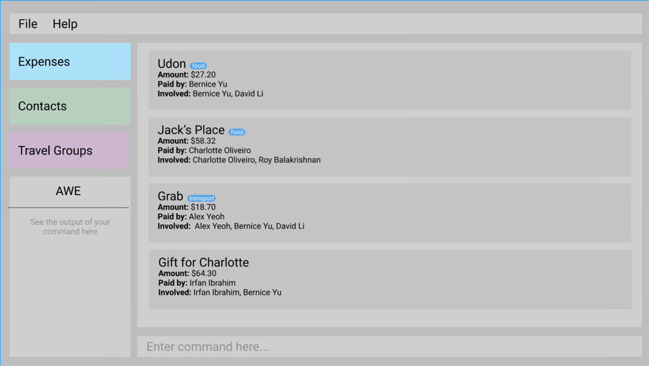

Around the World in $80 (AWE) is a **desktop app for managing contacts, optimized for use via a Command Line Interface** (CLI) while still having the benefits of a Graphical User Interface (GUI). If you can type fast, AWE can get your contact management tasks done faster than traditional GUI apps.

* Table of Contents
{:toc}

--------------------------------------------------------------------------------------------------------------------

## Quick start

1. Ensure you have Java `11` or above installed in your Computer.

1. Download the latest `awe.jar` from here (Coming Soon!).

1. Copy the file to the folder you want to use as the _home folder_ for your tp.

1. Double-click the file to start the app. The GUI similar to the below should appear in a few seconds. Note how the app contains some sample data.<br>
   

1. Type the command in the command box and press Enter to execute it. e.g. typing **`help`** and pressing Enter will open the help window.<br>
   Some example commands you can try:

   * **`contacts`** : The command `contacts` lists all contacts.
   
   * **`groups`** : The command `groups` lists all groups.

   * **`expenses`** : The command `expenses` lists all expenses in a particular group.
     
   * **`addcontact`** : The command `addcontact n/John Doe p/98765432 e/johnd@example.com a/John street, block 123, #01-01` adds a contact named `John Doe` to the Address Book.

   * **`deletecontact`** : The command `deletecontact 3` removes the 3rd contact shown in the current list.

   * **`creategroup`** : The command `creategroup gn/Bali n/John Doe n/Jane Doe t/friends` creates a group named Bali containing members `John Doe` and `Jane Doe`, with the tag `friends`.

   * **`deletegroup`** : The command `deletegroup gn/Bali` removes the group named Bali.
   
   * **`addexpense`** : The command `addexpense n/Alex Yeoh gn/Bali $/50 d/drinks` adds an expense paid for by `Alex Yeoh` into the group `Bali` of `$50` for `drinks`.

   * **`deleteexpense`** : The command `deleteexpense gn/Bali i/1` removes the 1st expense (by one-based-index) from the list of expenses for the group named Bali.

   * **`clear`** : The command `clear` removes all expenses / contacts / groups.

   * **`editcontact`** : The command `editcontact 1 n/Thomas Betty` edits the name of the 1st person to be Thomas Betty and removes all existing tags.

   * **`exit`** : The command `exit` exits the app.

1. Refer to the [Features](#features) below for details of each command.

--------------------------------------------------------------------------------------------------------------------

## Features

<div markdown="block" class="alert alert-info">

**Notes about the command format:**<br>

* Words in `UPPER_CASE` are the parameters to be supplied by the user.<br>
  e.g. in `add n/NAME`, `NAME` is a parameter which can be used as `add n/John Doe`.

* Items in square brackets are optional.<br>
  e.g `n/NAME [t/TAG]` can be used as `n/John Doe t/friend` or as `n/John Doe`.

* Items with `…`​ after them can be used multiple times including zero times.<br>
  e.g. `[t/TAG]…​` can be used as ` ` (i.e. 0 times), `t/friend`, `t/friend t/family` etc.

* Parameters can be in any order.<br>
  e.g. if the command specifies `n/NAME p/PHONE_NUMBER`, `p/PHONE_NUMBER n/NAME` is also acceptable.

* If a parameter is expected only once in the command but you specified it multiple times, only the last occurrence of the parameter will be taken.<br>
  e.g. if you specify `p/12341234 p/56785678`, only `p/56785678` will be taken.

* Extraneous parameters for commands that do not take in parameters (such as `help`, `list`, `exit` and `clear`) will be ignored.<br>
  e.g. if the command specifies `help 123`, it will be interpreted as `help`.

</div>

### Viewing help : `help`

Shows a message explaning how to access the help page.


Format: `help`

### Listing all contacts : `contacts`

Shows a list of all contacts in address book.

Format: `contacts`

### Adding a person: `addcontact`

Adds a person to the address book.

Format: `addcontact n/NAME p/PHONE_NUMBER e/EMAIL a/ADDRESS [t/TAG]…​`

<div markdown="span" class="alert alert-primary">:bulb: **Tip:**
A person can have any number of tags (including 0)
</div>

Examples:
* `addcontact n/John Doe p/98765432 e/johnd@example.com a/John street, block 123, #01-01`
* `addcontact n/Betsy Crowe t/friend e/betsycrowe@example.com a/Newgate Prison p/1234567 t/criminal`

### Editing a person : `editcontact`

Edits an existing person in the address book.

Format: `editcontact INDEX [n/NAME] [p/PHONE] [e/EMAIL] [a/ADDRESS] [t/TAG]…​`

* Edits the person at the specified `INDEX`. The index refers to the index number shown in the displayed person list. The index **must be a positive integer** 1, 2, 3, …​
* At least one of the optional fields must be provided.
* Existing values will be updated to the input values.
* When editing tags, the existing tags of the person will be removed i.e adding of tags is not cumulative.
* You can remove all the person’s tags by typing `t/` without
    specifying any tags after it.

Examples:
*  `editcontact 1 p/91234567 e/johndoe@example.com` Edits the phone number and email address of the 1st person to be `91234567` and `johndoe@example.com` respectively.
*  `editcontact 2 n/Betsy Crower t/` Edits the name of the 2nd person to be `Betsy Crower` and clears all existing tags.

### Deleting a person : `delete`

Deletes the specified person from the address book.

Format: `deletecontact INDEX`

* Deletes the person at the specified `INDEX`.
* The index refers to the index number shown in the displayed person list.
* The index **must be a positive integer** 1, 2, 3, …​

Examples:
* `persons` followed by `deletecontact 2` deletes the 2nd person in the address book.
* `find Betsy` followed by `deletecontact 1` deletes the 1st person in the results of the `find` command.

### Locating persons by name: `findcontacts`

Finds persons whose names contain any of the given keywords.

Format: `findcontacts KEYWORD [MORE_KEYWORDS]`

* The search is case-insensitive. e.g `hans` will match `Hans`
* The order of the keywords does not matter. e.g. `Hans Bo` will match `Bo Hans`
* Only the name is searched.
* Only full words will be matched e.g. `Han` will not match `Hans`
* Persons matching at least one keyword will be returned (i.e. `OR` search).
  e.g. `Hans Bo` will return `Hans Gruber`, `Bo Yang`

Examples:
* `findcontacts John` returns `john` and `John Doe`
* `findcontacts alex david` returns `Alex Yeoh`, `David Li`<br>
  

### Listing all groups : `groups`

Shows a list of all groups in GroupPage.

Format: `groups`

### Creating a Travel Group: ```creategroup```
Creates a group of people of your choice from your address book.
Adds you as a member of the group by default.

Format: `creategroup gn/GROUP_NAME n/NAME1 [n/NAME2] [n/NAME3]...[t/TAG1]`

* GROUP_NAME is a mandatory field.
* A group with the same name as GROUP_NAME cannot exist for the creation of a group through this command. 
* At least one NAME is necessary.
* The names are required to be in the address book and should match contact names exactly.
* Tags cannot have whitespace and special characters other than alphanumeric characters.
* Tags are optional.

Examples:
* creategroup gn/Bali n/Jacob Tan n/Max Chia n/Julianne Tay
* creategroup gn/London n/Justin Lee n/Raj Gopal n/Keith Chia

### Deleting a Travel Group: `deletegroup`
Deletes a group from your groups.
All the details from the group are lost once this action is completed.

Format: `deletegroup gn/GROUP_NAME`

* GROUP_NAME is a mandatory field.
* A group with GROUP_NAME as its name must exist.

Examples:
* `deletegroup gn/Bali`
* `deletegroup gn/London`

### Locating group by name: `findgroups`

Find groups whose names contain any of the given keywords.

Format: `findgroups KEYWORD [MORE_KEYWORDS]`

* The search is case-insensitive. e.g `london` will match `London`
* The order of the keywords does not matter. e.g. `United States` will match `States United`
* Only the group name is searched.
* Only full words will be matched e.g. `London` will not match `Lond`
* Groups matching at least one keyword will be returned (i.e. `OR` search).
  e.g. `Taiwan Malaysia` will return `Taiwan`, `Malaysia`

Examples:
* `findgroups London` returns `London` and `london trip`
* `findgroups Taiwan Malaysia` returns `Taiwan` `Malaysia`<br>
  
  
### Viewing a shared expense: `expenses`
Shows a list containing all existing expenses within the specified travel group. Expenses are sorted from most recent to least recent.

Format: `expenses INDEX`

* INDEX argument is mandatory.
* INDEX must correspond to a valid index of an existing travel group.

Examples: 
* `groups` followed by `expense 1` shows all the expenses of the 1st travel group in the group list.

### Adding a shared expense: `addexpense`
Adds a shared expense to the specified travel group.
The expense can be paid for and split among any number of contacts within the travel group.

Format: `addexpense n/PAYER_NAME gn/GROUP_NAME $/TOTAL AMOUNT PAID d/DESCRIPTION n/[PAYEE WHO MADE A PERSONAL PAYMENT] $/[PAYEE'S PERSONAL PAYMENT TO EXCLUDE FROM TOTAL AMOUNT] ex/[PERSON TO EXCLUDE FROM EXPENSE]`

* There should be at least one PAYER_NAME in the command.
* PAYER_NAME must be immediately followed by the GROUP NAME.
* By default, all members of the group will be included in the expense.
* The names are required to be in the address book.
* The names are required to be in the specified group.
* Each expense is a class with a unique ID.
* Each personal payment has to be a name immediately followed by the amount of the personal payment.

Examples:
* addexpense n/Nic gn/Catch up $/50 d/Movie and dinner
* addexpense n/Tom gn/Date $/60 d/Big meal but Jerry wants to pay for his own Coke n/Jerry $/2
* addexpense n/Keith gn/Movie night $/40 d/For movie but Kelly didn't watch ex/Kelly

### Deleting a shared expense: `deleteexpense`

Deletes a shared expense from a travel group.
This command deletes the expense for all members involved in the expense.

Format: `deleteexpense gn/GROUP_NAME i/INDEX`

* GROUP_NAME argument is mandatory.
* INDEX argument is mandatory.
* INDEX has to be between 1 and the length of the list of expenses for the group with name GROUP_NAME.

Examples:
* `deleteexpense gn/Bali i/1`
* `deleteexpense gn/London i/2`

### Locating expenses by description: `findexpenses`

Finds expenses within the specified group which descriptions contain any of the given keywords.

Format: `findexpenses KEYWORD [MORE_KEYWORDS] gn/GROUP_NAME`

* The search is case-insensitive. e.g `dinner` will match `Dinner`
* The order of the keywords does not matter. e.g. `Dinner Transportation` will match `Transportation Dinner`
* Only the description is searched.
* Only full words will be matched e.g. `Dinner` will not match `Dinners`
* Expenses matching at least one keyword will be returned (i.e. `OR` search).
  e.g. `Dinner Transportation` will return `Friday dinner`, `Transportation tickets`

Examples:
* `findexpenses dinner gn/London` returns `dinner` and `Friday dinner`
* `findexpenses lunch souvenirs` returns `lunch`, `souvenirs`<br>

### Saving the data

AWE data are saved in the hard disk automatically after any command that changes the data. There is no need to save manually.

### Editing the data file

AWE data are saved as a JSON file `[JAR file location]/data/awe.json`. Advanced users are welcome to update data directly by editing that data file.

<div markdown="span" class="alert alert-warning">:exclamation: **Caution:**
If your changes to the data file makes its format invalid, AWE will discard all data and start with an empty data file at the next run.
</div>

### Clearing all entries : `clear`

Clears all entries from the AWE.

Format: `clear`

### Exiting the program : `exit`

Exits the program.

Format: `exit`


## FAQ

**Q**: How do I transfer my data to another Computer?<br>
**A**: Install the app in the other computer and overwrite the empty data file it creates with the file that contains the data of your previous AWE home folder.

**Q**: What if the Jar file does not open properly when I double click on it?<br>
**A**: Open a command prompt in that folder and run the command `java -jar -ea AWE.jar`.

**Q**: What do I do if I see `AWE.jar` cannot be opened because it is from an unidentified developer when I double click the jar file on a mac?<br>
**A**: Go to ` System Preferences -> Security and Privacy -> General` and click on `Open anyways` as such
<br>
<br>
If your questions are not answered in the FAQ, check out the issue page on our GitHub linked [here](https://github.com/AY2122S1-CS2103T-F13-1/tp/issues).
--------------------------------------------------------------------------------------------------------------------

## Command summary

Action | Format, Examples
--------|------------------
**Add Contact** | `addcontact n/NAME p/PHONE_NUMBER e/EMAIL a/ADDRESS [t/TAG]…​` <br> e.g., `add n/James Ho p/22224444 e/jamesho@example.com a/123, Clementi Rd, 1234665 t/friend t/colleague`
**Add Expense** | `add expense add expense /des DESCRIPTION /by PAYER_NAME1 AMOUNT PAID BY NAME 1 /for PAYEE_NAME1 PAYEE_NAME 2` <br> e.g., `add expense /des Koi /by Jake 20.00 /for Justin, Raj, Keith`
**Clear** | `clear`
**Create Group** | `creategroup gn/GROUP_NAME n/NAME1 n/NAME2 n/NAME3...t/TAG1` <br> e.g., `creategroup gn/Bali n/Jacob Tan n/Max Chia n/Julianne Tay t/friends`
**Delete Contact** | `deletecontact INDEX`<br> e.g., `delete 3`
**Delete Group** | `deletegroup gn/GROUP_NAME` <br> e.g., `deletegroup gn/Vienna`
**Delete Expense** | `deleteexpense gn/GROUP_NAME i/INDEX` <br> e.g., `deleteexpense gn/Bali i/1`
**Edit Contact** | `editcontact INDEX [n/NAME] [p/PHONE_NUMBER] [e/EMAIL] [a/ADDRESS] [t/TAG]…​`<br> e.g.,`edit 2 n/James Lee e/jameslee@example.com`
**Find Contacts** | `findcontacts KEYWORD [MORE_KEYWORDS]`<br> e.g., `find James Jake`
**Find Groups** | `findgroups KEYWORD [MORE_KEYWORDS]`<br> e.g., `find James Jake`
**Help** | `help`
**View Contacts** | `contacts`
**View Groups** | `groups`
**View Expense** | `expense INDEX` <br> e.g., `expense 2`
