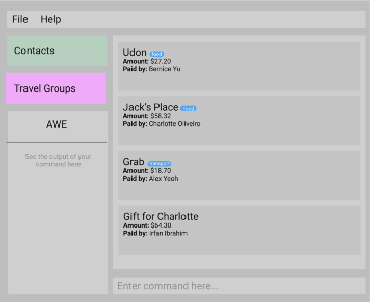

**Around the World in $80 (AWE) is a desktop application for spiting expenses on trips.** While it has a GUI, most of the user interactions happen using a CLI (Command Line Interface).

AWE promises to revolutionises the group-travel space. With AWE, bills can be split and monitored in a centralised manner that minimises the potential for disputes and maximises the efficiency of payment and recollection of debts.

* If you are interested in using AWE, head over to the [_Quick Start_ section of the **User Guide**](UserGuide.html#quick-start).
* If you are interested about developing AWE, the [**Developer Guide**](DeveloperGuide.html) is a good place to start.

**Acknowledgements**

* Libraries used: [JavaFX](https://openjfx.io/), [Jackson](https://github.com/FasterXML/jackson), [JUnit5](https://github.com/junit-team/junit5)
